# coding\BashCodingApp.kt

To document the `BashCodingApp` class and its functionality using mermaid.js diagrams, we'll break down the process into several parts, focusing on the class structure, settings management, and the user message handling process. This approach will help in understanding the flow and interactions within the `BashCodingApp`.

#### 1. Class Overview

First, let's create a diagram to represent the overall class structure and its inheritance from `ApplicationServer`.

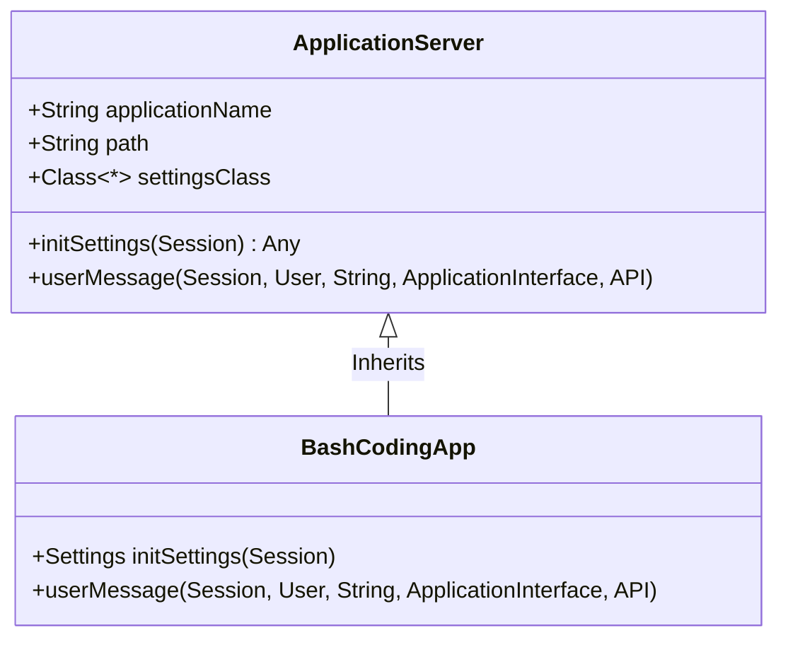
```mermaid
classDiagram
    class ApplicationServer {
        +String applicationName
        +String path
        +Class~*~ settingsClass
        +initSettings(Session) Any
        +userMessage(Session, User, String, ApplicationInterface, API)
    }
    class BashCodingApp {
        +Settings initSettings(Session)
        +userMessage(Session, User, String, ApplicationInterface, API)
    }
    ApplicationServer <|-- BashCodingApp: Inherits
```

#### 2. Settings Management

Next, we'll illustrate how `BashCodingApp` manages its settings through the `Settings` data class and the `initSettings` method.

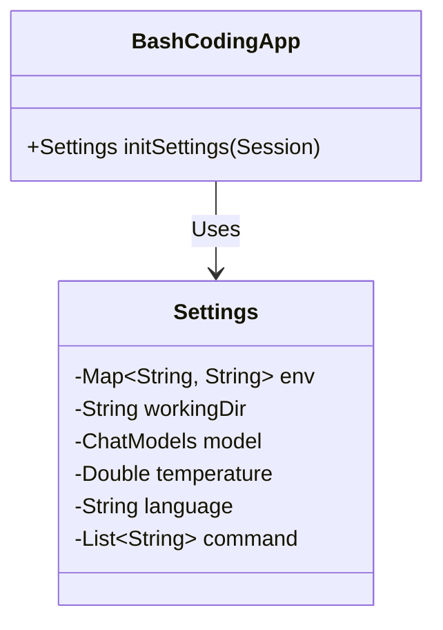
```mermaid
classDiagram
    class BashCodingApp {
        +Settings initSettings(Session)
    }
    class Settings {
        -Map~String, String~ env
        -String workingDir
        -ChatModels model
        -Double temperature
        -String language
        -List~String~ command
    }
    BashCodingApp --> Settings: Uses
```

#### 3. User Message Handling Process

Finally, let's depict the process flow when handling a user message. This includes fetching settings, creating a `CodingAgent`, and starting it with the user's message.

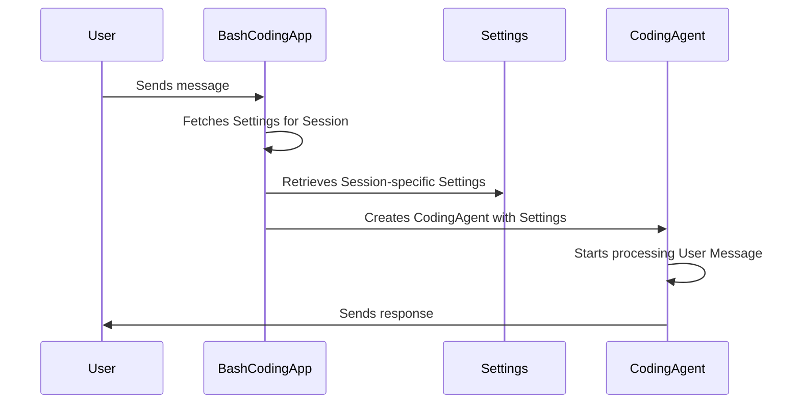
```mermaid
sequenceDiagram
    participant U as User
    participant B as BashCodingApp
    participant S as Settings
    participant C as CodingAgent
    U->>B: Sends message
    B->>B: Fetches Settings for Session
    B->>S: Retrieves Session-specific Settings
    B->>C: Creates CodingAgent with Settings
    C->>C: Starts processing User Message
    C->>U: Sends response
```

These diagrams provide a visual documentation of the `BashCodingApp` class, highlighting its inheritance, settings management, and the user message handling process. By breaking down the documentation into these components, it becomes easier to understand the functionality and flow of the application.

# coding\GmailCodingApp.kt

To document the `GmailCodingApp` class and its interactions with other components, we can use Mermaid.js diagrams. Mermaid.js is a tool that allows the generation of diagrams and flowcharts from text in a similar manner as Markdown. Below, we will create diagrams to represent the structure and flow of the `GmailCodingApp`.

#### Class Diagram

First, let's create a class diagram to show the relationship between `GmailCodingApp` and other classes it interacts with.

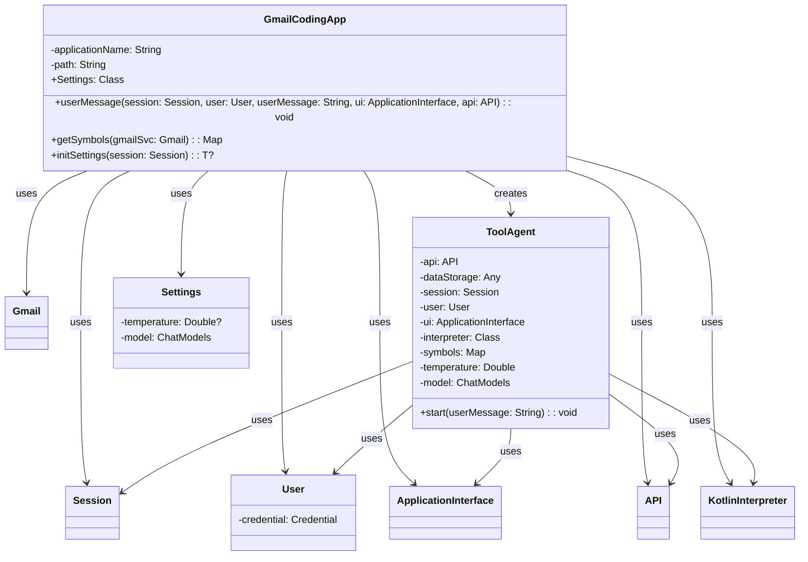
```mermaid
classDiagram
    class GmailCodingApp {
      -applicationName: String
      -path: String
      +userMessage(session: Session, user: User, userMessage: String, ui: ApplicationInterface, api: API): void
      +getSymbols(gmailSvc: Gmail): Map
      +Settings: Class
      +initSettings(session: Session): T?
    }
    class Session
    class User {
      -credential: Credential
    }
    class ApplicationInterface
    class API
    class Gmail
    class KotlinInterpreter
    class ToolAgent {
      -api: API
      -dataStorage: Any
      -session: Session
      -user: User
      -ui: ApplicationInterface
      -interpreter: Class
      -symbols: Map
      -temperature: Double
      -model: ChatModels
      +start(userMessage: String): void
    }
    class Settings {
      -temperature: Double?
      -model: ChatModels
    }

    GmailCodingApp --> Session : uses
    GmailCodingApp --> User : uses
    GmailCodingApp --> ApplicationInterface : uses
    GmailCodingApp --> API : uses
    GmailCodingApp --> Gmail : uses
    GmailCodingApp --> KotlinInterpreter : uses
    GmailCodingApp --> ToolAgent : creates
    GmailCodingApp --> Settings : uses
    ToolAgent --> KotlinInterpreter : uses
    ToolAgent --> API : uses
    ToolAgent --> Session : uses
    ToolAgent --> User : uses
    ToolAgent --> ApplicationInterface : uses
```

#### Sequence Diagram

Next, let's create a sequence diagram to illustrate how a user message is processed by the `GmailCodingApp`.

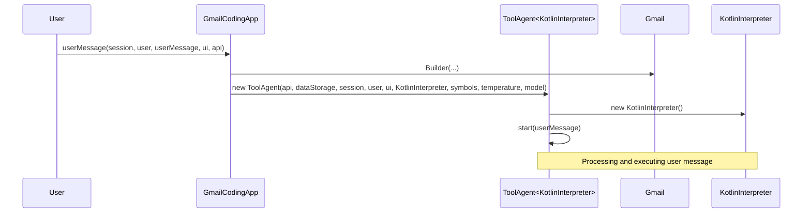
```mermaid
sequenceDiagram
    participant User as User
    participant GmailCodingApp as GmailCodingApp
    participant ToolAgent as ToolAgent<KotlinInterpreter>
    participant Gmail as Gmail
    participant KotlinInterpreter as KotlinInterpreter

    User->>GmailCodingApp: userMessage(session, user, userMessage, ui, api)
    GmailCodingApp->>Gmail: Builder(...)
    GmailCodingApp->>ToolAgent: new ToolAgent(api, dataStorage, session, user, ui, KotlinInterpreter, symbols, temperature, model)
    ToolAgent->>KotlinInterpreter: new KotlinInterpreter()
    ToolAgent->>ToolAgent: start(userMessage)
    Note over ToolAgent,KotlinInterpreter: Processing and executing user message
```

These diagrams provide a visual representation of the `GmailCodingApp` class structure and its interaction flow when processing a user message. The class diagram shows the relationships and dependencies between classes, while the sequence diagram illustrates the steps taken when a user message is received and processed.

# coding\AwsCodingApp.kt

To document the `AwsCodingApp` class and its functionality using mermaid.js diagrams, we'll break down the process into several parts, focusing on the class structure, the flow of the `userMessage` method, and the settings management. This approach will help in understanding the overall architecture and the specific processes within the `AwsCodingApp`.

#### Class Structure

First, let's visualize the class hierarchy and relationships:

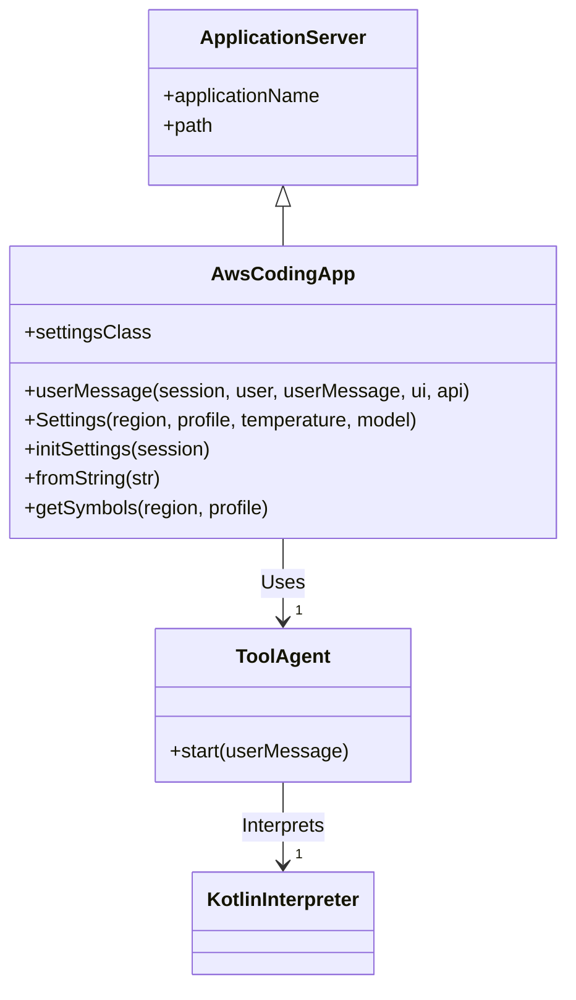
```mermaid
classDiagram
    ApplicationServer <|-- AwsCodingApp
    AwsCodingApp : +userMessage(session, user, userMessage, ui, api)
    AwsCodingApp : +Settings(region, profile, temperature, model)
    AwsCodingApp : +settingsClass
    AwsCodingApp : +initSettings(session)
    AwsCodingApp : +fromString(str)
    AwsCodingApp : +getSymbols(region, profile)
    ApplicationServer : +applicationName
    ApplicationServer : +path
    class ToolAgent {
        +start(userMessage)
    }
    AwsCodingApp --> "1" ToolAgent : Uses
    class KotlinInterpreter
    ToolAgent --> "1" KotlinInterpreter : Interprets
```

This diagram shows the `AwsCodingApp` class extending `ApplicationServer` and its relationship with `ToolAgent` and `KotlinInterpreter`. It highlights the main components and methods within `AwsCodingApp`, including the `Settings` data class and utility methods like `fromString` and `getSymbols`.

#### User Message Handling Flow

Next, let's illustrate the flow when handling a user message through the `userMessage` method:

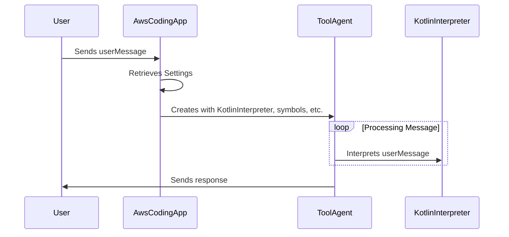
```mermaid
sequenceDiagram
    participant User as User
    participant AwsCodingApp as AwsCodingApp
    participant ToolAgent as ToolAgent
    participant KotlinInterpreter as KotlinInterpreter

    User->>AwsCodingApp: Sends userMessage
    AwsCodingApp->>AwsCodingApp: Retrieves Settings
    AwsCodingApp->>ToolAgent: Creates with KotlinInterpreter, symbols, etc.
    loop Processing Message
        ToolAgent->>KotlinInterpreter: Interprets userMessage
    end
    ToolAgent->>User: Sends response
```

This sequence diagram demonstrates how a user message is processed by the `AwsCodingApp`. It starts with the user sending a message, followed by the app retrieving settings, creating a `ToolAgent` instance configured with a `KotlinInterpreter`, and processing the message. Finally, the response is sent back to the user.

#### Settings Management

Lastly, let's depict how settings are managed within the `AwsCodingApp`:

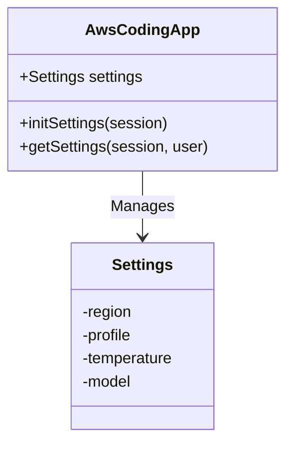
```mermaid
classDiagram
    class AwsCodingApp {
        +Settings settings
        +initSettings(session)
        +getSettings(session, user)
    }
    class Settings {
        -region
        -profile
        -temperature
        -model
    }
    AwsCodingApp --> Settings : Manages
```

This class diagram focuses on the `Settings` management within the `AwsCodingApp`. It shows the `Settings` data class and its relationship with the main app class, highlighting how settings are initialized and retrieved.

By combining these diagrams, we can provide a comprehensive documentation of the `AwsCodingApp` class, covering its structure, key functionalities, and the flow of processing user messages.

# coding\JDBCCodingApp.kt

To document the `JDBCCodingApp` class and its interactions using Mermaid.js, we'll break down the process into several key components and interactions. This will include the initialization of the application, handling user messages, establishing JDBC connections, and utilizing the Kotlin interpreter with custom symbols.

#### Application Initialization

First, let's visualize the initialization process of the `JDBCCodingApp`, focusing on how it extends `ApplicationServer` and sets up its basic configuration.

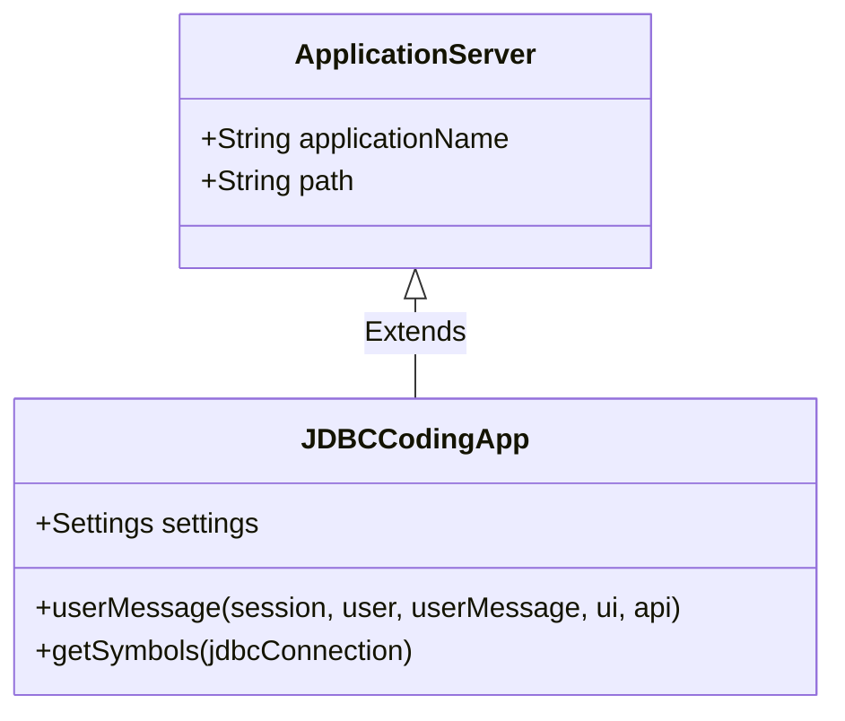
```mermaid
classDiagram
    class ApplicationServer {
        +String applicationName
        +String path
    }
    class JDBCCodingApp {
        +Settings settings
        +userMessage(session, user, userMessage, ui, api)
        +getSymbols(jdbcConnection)
    }
    ApplicationServer <|-- JDBCCodingApp: Extends
```

#### Handling User Messages

When a user sends a message, the `userMessage` method is invoked. This method is responsible for creating a JDBC connection based on user-specific settings and starting a `ToolAgent` with a Kotlin interpreter and custom symbols.

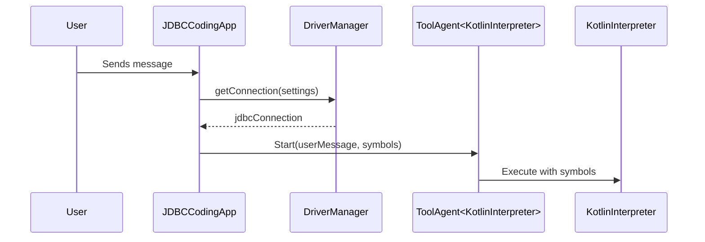
```mermaid
sequenceDiagram
    participant User as User
    participant JDBCCodingApp as JDBCCodingApp
    participant DriverManager as DriverManager
    participant ToolAgent as ToolAgent<KotlinInterpreter>
    User->>JDBCCodingApp: Sends message
    JDBCCodingApp->>DriverManager: getConnection(settings)
    DriverManager-->>JDBCCodingApp: jdbcConnection
    JDBCCodingApp->>ToolAgent: Start(userMessage, symbols)
    ToolAgent->>KotlinInterpreter: Execute with symbols
```

#### Establishing JDBC Connections

The JDBC connection is established using the `DriverManager.getConnection` method, which utilizes settings provided by the user or defaults defined in the `Settings` data class.

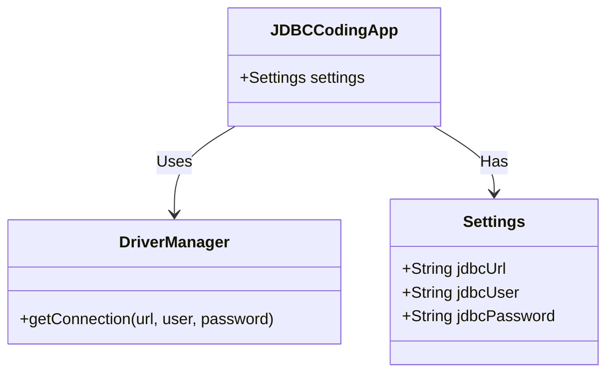
```mermaid
classDiagram
    class JDBCCodingApp {
        +Settings settings
    }
    class DriverManager {
        +getConnection(url, user, password)
    }
    class Settings {
        +String jdbcUrl
        +String jdbcUser
        +String jdbcPassword
    }
    JDBCCodingApp --> DriverManager : Uses
    JDBCCodingApp --> Settings : Has
```

#### Utilizing Kotlin Interpreter with Custom Symbols

The `ToolAgent` is initialized with a Kotlin interpreter and a set of custom symbols derived from the JDBC connection. This allows for dynamic execution of Kotlin code with database interaction capabilities.

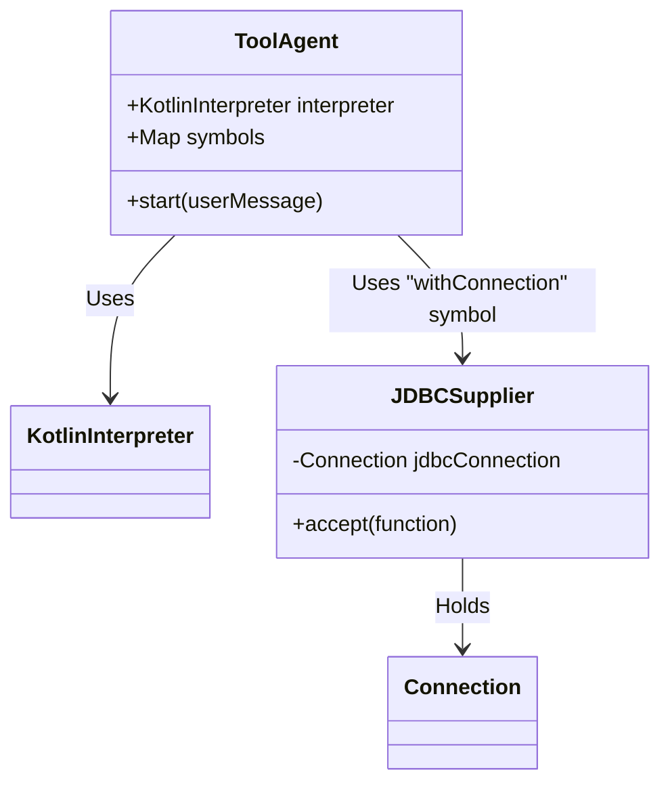
```mermaid
classDiagram
    class ToolAgent {
        +KotlinInterpreter interpreter
        +Map symbols
        +start(userMessage)
    }
    class KotlinInterpreter {
    }
    class JDBCSupplier {
        -Connection jdbcConnection
        +accept(function)
    }
    class Connection {
    }
    ToolAgent --> KotlinInterpreter : Uses
    ToolAgent --> JDBCSupplier : Uses "withConnection" symbol
    JDBCSupplier --> Connection : Holds
```

This documentation provides a high-level overview of the `JDBCCodingApp` class and its key functionalities using Mermaid.js diagrams. It illustrates the application's initialization, how it handles user messages, establishes JDBC connections, and utilizes a Kotlin interpreter with custom symbols for dynamic code execution.

# coding\PowershellCodingApp.kt

To document the `PowershellCodingApp` class and its workflow using mermaid.js diagrams, we'll break down the process into several key components: initialization, settings management, and user message handling. This approach will help visualize the flow and interactions within the `PowershellCodingApp`.

#### 1. Class Initialization

The initialization process involves the creation of the `PowershellCodingApp` instance, inheriting properties from the `ApplicationServer`.

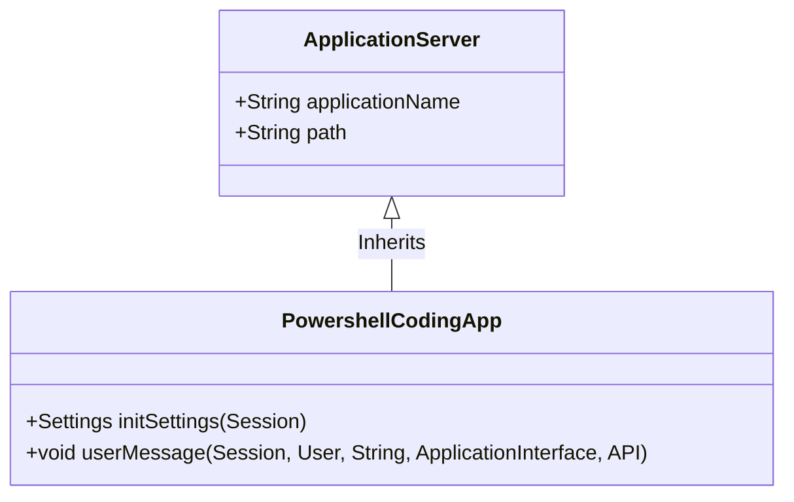
```mermaid
classDiagram
  class ApplicationServer {
    +String applicationName
    +String path
  }
  class PowershellCodingApp {
    +Settings initSettings(Session)
    +void userMessage(Session, User, String, ApplicationInterface, API)
  }
  ApplicationServer <|-- PowershellCodingApp: Inherits
```

#### 2. Settings Management

The `Settings` data class is crucial for configuring the application. It includes environment variables, working directory, model, temperature, language, and command settings.

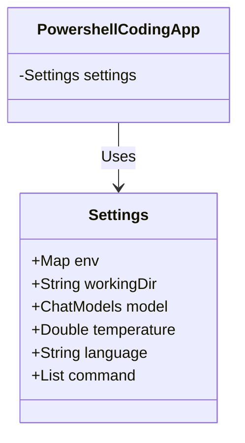
```mermaid
classDiagram
  class PowershellCodingApp {
    -Settings settings
  }
  class Settings {
    +Map env
    +String workingDir
    +ChatModels model
    +Double temperature
    +String language
    +List command
  }
  PowershellCodingApp --> Settings: Uses
```

#### 3. User Message Handling

When a user sends a message, the `PowershellCodingApp` processes it using the `CodingAgent`. This involves fetching the settings, creating a `CodingAgent` instance, and starting the interaction based on the user's message.

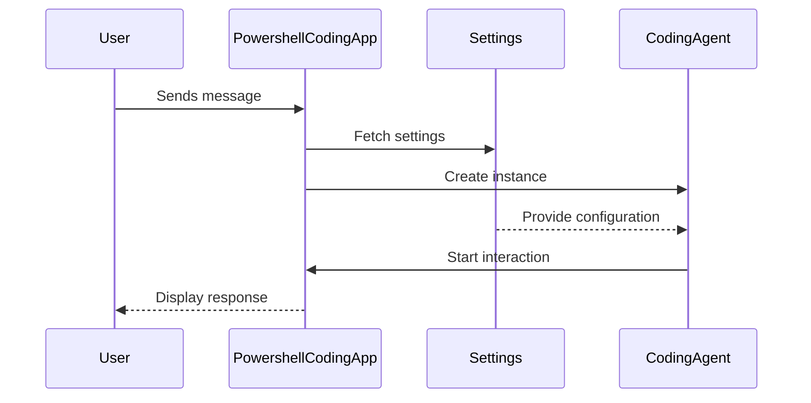
```mermaid
sequenceDiagram
  participant User as User
  participant PowershellCodingApp as PowershellCodingApp
  participant Settings as Settings
  participant CodingAgent as CodingAgent

  User->>PowershellCodingApp: Sends message
  PowershellCodingApp->>Settings: Fetch settings
  PowershellCodingApp->>CodingAgent: Create instance
  Settings-->>CodingAgent: Provide configuration
  CodingAgent->>PowershellCodingApp: Start interaction
  PowershellCodingApp-->>User: Display response
```

#### 4. Overall Application Workflow

Combining the components, the overall workflow of the `PowershellCodingApp` from initialization to user interaction can be visualized as follows:

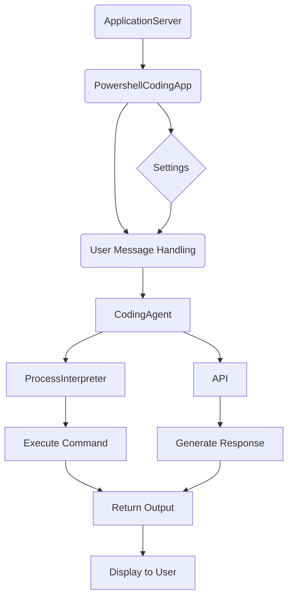
```mermaid
graph TD
    A(ApplicationServer) --> B(PowershellCodingApp)
    B --> C{Settings}
    B --> D(User Message Handling)
    C --> D
    D --> E[CodingAgent]
    E --> F[ProcessInterpreter]
    E --> G[API]
    F --> H[Execute Command]
    G --> I[Generate Response]
    H --> J[Return Output]
    I --> J
    J --> K[Display to User]
```

This documentation provides a high-level overview of the `PowershellCodingApp` class using mermaid.js diagrams, illustrating the class inheritance, settings management, and the process flow from receiving a user message to displaying the response.

# general\IllustratedStorybookApp.kt

To document the `IllustratedStorybookApp` and its related components using mermaid.js diagrams, we'll break down the system into several key parts: the application flow, actor interactions, and the process of generating a storybook. This approach will help visualize the relationships and interactions within the system.

#### Application Flow

The application flow diagram illustrates the high-level process from receiving a user message to generating a storybook.

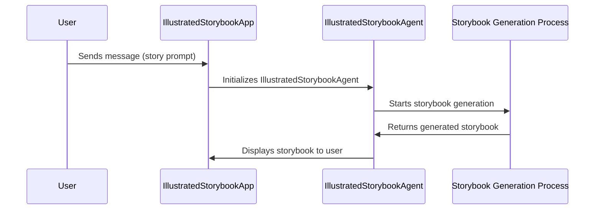
```mermaid
sequenceDiagram
    participant U as User
    participant A as IllustratedStorybookApp
    participant S as IllustratedStorybookAgent
    participant G as Storybook Generation Process

    U->>A: Sends message (story prompt)
    A->>S: Initializes IllustratedStorybookAgent
    S->>G: Starts storybook generation
    G->>S: Returns generated storybook
    S->>A: Displays storybook to user
```

#### Actor Interactions

This diagram shows how the `IllustratedStorybookAgent` interacts with different actors to generate a storybook.

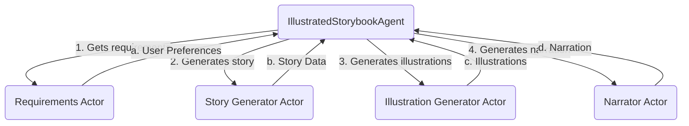
```mermaid
graph TD
    IA(IllustratedStorybookAgent) -->|1. Gets requirements| RA(Requirements Actor)
    IA -->|2. Generates story| SGA(Story Generator Actor)
    IA -->|3. Generates illustrations| IGA(Illustration Generator Actor)
    IA -->|4. Generates narration| NA(Narrator Actor)
    RA -->|a. User Preferences| IA
    SGA -->|b. Story Data| IA
    IGA -->|c. Illustrations| IA
    NA -->|d. Narration| IA
```

#### Storybook Generation Process

This diagram details the steps involved in generating a storybook, from parsing user preferences to formatting the final HTML document.

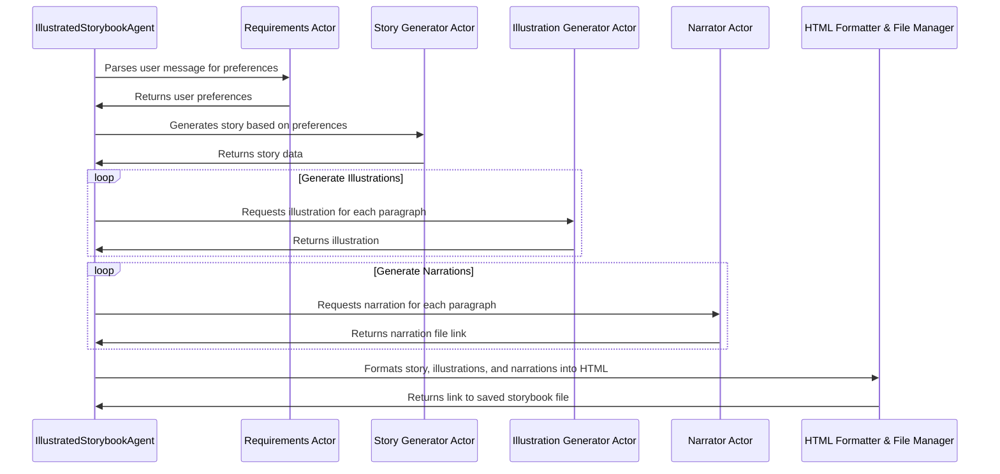
```mermaid
sequenceDiagram
    participant IA as IllustratedStorybookAgent
    participant RA as Requirements Actor
    participant SGA as Story Generator Actor
    participant IGA as Illustration Generator Actor
    participant NA as Narrator Actor
    participant FM as HTML Formatter & File Manager

    IA->>RA: Parses user message for preferences
    RA->>IA: Returns user preferences
    IA->>SGA: Generates story based on preferences
    SGA->>IA: Returns story data
    loop Generate Illustrations
        IA->>IGA: Requests illustration for each paragraph
        IGA->>IA: Returns illustration
    end
    loop Generate Narrations
        IA->>NA: Requests narration for each paragraph
        NA->>IA: Returns narration file link
    end
    IA->>FM: Formats story, illustrations, and narrations into HTML
    FM->>IA: Returns link to saved storybook file
```

These diagrams provide a visual representation of the `IllustratedStorybookApp` system, illustrating the flow from user input to the final storybook generation, including the interactions between the main agent and its actors.

# general\OutlineManager.kt

To document the `OutlineManager` class and its inner data classes (`NodeList`, `Node`, and `OutlinedText`) using mermaid.js diagrams, we'll break down the structure and relationships within the code. This will help visualize the class hierarchy, method calls, and data flow.

#### Class Hierarchy Diagram

This diagram shows the relationship between the `OutlineManager` class and its inner data classes.

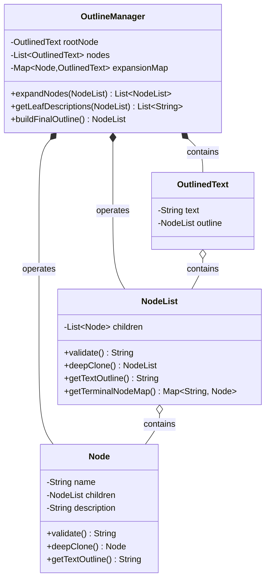
```mermaid
classDiagram
    class OutlineManager {
        -OutlinedText rootNode
        -List~OutlinedText~ nodes
        -Map~Node,OutlinedText~ expansionMap
        +expandNodes(NodeList) List~NodeList~
        +getLeafDescriptions(NodeList) List~String~
        +buildFinalOutline() NodeList
    }
    class NodeList {
        -List~Node~ children
        +validate() String
        +deepClone() NodeList
        +getTextOutline() String
        +getTerminalNodeMap() Map~String, Node~
    }
    class Node {
        -String name
        -NodeList children
        -String description
        +validate() String
        +deepClone() Node
        +getTextOutline() String
    }
    class OutlinedText {
        -String text
        -NodeList outline
    }

    OutlineManager *-- OutlinedText : contains
    OutlineManager *-- NodeList : operates
    OutlineManager *-- Node : operates
    NodeList o-- Node : contains
    OutlinedText o-- NodeList : contains
```

#### Method Call Flow Diagram

This diagram illustrates how methods within `OutlineManager` interact with each other and with methods of `NodeList` and `Node` to expand nodes and build the final outline.

```mermaid
graph TD
    A(OutlineManager) -->|uses| B(expandNodes NodeList)
    A -->|uses| C(getLeafDescriptions NodeList)
    A -->|uses| D(buildFinalOutline)
    B -->|calls| E(expandNodes Node)
    E -->|deep clones| F(Node)
    B -->|returns| G(List NodeList)
    C -->|calls| H(getLeafDescriptions Node)
    H -->|returns| I(List String)
    D -->|deep clones| J(NodeList)
    D -->|recursively calls| D
    J -->|calls| K(validate)
    K -->|returns| L(String?)
```

#### Data Flow Diagram

This diagram focuses on the data flow between the `NodeList` and `Node` classes, especially regarding the cloning and validation processes.

```mermaid
graph LR
    A(NodeList) -->|deepClone| B(NodeList : clone)
    A -->|validate| C(String : validation result)
    D(Node) -->|deepClone| E(Node : clone)
    D -->|validate| F(String : validation result)
    B -->|used in| G(OutlineManager : expandNodes)
    E -->|used in| H(OutlineManager : expandNodes)
    C -.->|if invalid| I(OutlineManager : log warning)
    F -.->|if invalid| I
```

These diagrams provide a visual representation of the `OutlineManager` class structure, the interactions between its methods, and the flow of data, which can be particularly useful for understanding the code's architecture and behavior at a glance.

# general\OutlineApp.kt

To document the `OutlineApp` and its associated classes using mermaid.js diagrams, we'll break down the system into its core components and interactions. This will help visualize the relationships and data flow within the application.

#### Overview of OutlineApp System

The `OutlineApp` system is designed to facilitate the exploration of concepts through the creation and expansion of outlines. It leverages AI models for generating and expanding outlines, visualizing embeddings, and optionally writing a final essay based on the expanded outline.

```mermaid
classDiagram
    class OutlineApp{
      +String applicationName
      +String domainName
      +Settings initSettings(Session)
      +void userMessage(Session, User, String, ApplicationInterface, API)
    }

    class Settings{
      +List models
      +ChatModels parsingModel
      +Double temperature
      +Int minTokensForExpansion
      +Boolean showProjector
      +Boolean writeFinalEssay
      +Double budget
    }

    class OutlineAgent{
      +API api
      +List models
      +ChatModels firstLevelModel
      +ChatModels parsingModel
      +Int minSize
      +Boolean writeFinalEssay
      +Boolean showProjector
      +String userMessage
      +ApplicationInterface ui
      +String domainName
      +void buildMap()
    }

    class OutlineManager{
      +NodeList rootNode
      +List nodes
      +Map expansionMap
      +NodeList buildFinalOutline()
    }

    class OutlineActors{
      <<enumeration>> ActorType
    }

    OutlineApp --> Settings : has
    OutlineApp --> OutlineAgent : initiates
    OutlineAgent --> OutlineManager : uses
    OutlineAgent --> OutlineActors : uses
```

#### Detailed Interaction for Outline Generation

The process of generating and expanding an outline involves several steps, starting from receiving a user message to building the final outline and optionally visualizing embeddings and writing a final essay.

```mermaid
sequenceDiagram
    participant User as User
    participant OutlineApp as OutlineApp
    participant OutlineAgent as OutlineAgent
    participant OutlineManager as OutlineManager
    participant API as API

    User->>OutlineApp: userMessage
    activate OutlineApp
    OutlineApp->>OutlineAgent: buildMap()
    activate OutlineAgent

    loop Outline Generation
        OutlineAgent->>OutlineManager: initial outline
        activate OutlineManager
        OutlineManager-->>OutlineAgent: rootNode
        deactivate OutlineManager

        OutlineAgent->>OutlineManager: expand nodes
        activate OutlineManager
        OutlineManager-->>OutlineAgent: expanded outline
        deactivate OutlineManager
    end

    OutlineAgent->>OutlineManager: buildFinalOutline()
    activate OutlineManager
    OutlineManager-->>OutlineAgent: finalOutline
    deactivate OutlineManager

    opt Visualization and Final Essay
        OutlineAgent->>API: visualize embeddings / write essay
        API-->>OutlineAgent: visualization / essay
    end

    deactivate OutlineAgent
    OutlineAgent-->>OutlineApp: completed outline
    deactivate OutlineApp
    OutlineApp-->>User: display outline
```

#### Explanation

1. **User Interaction**: The user interacts with the `OutlineApp` by sending a message (userMessage) that contains the main idea or topic for outline generation.
2. **OutlineApp Initialization**: Upon receiving the user's message, `OutlineApp` initializes the `OutlineAgent` with the necessary settings and information.
3. **Outline Generation Process**:
   - The `OutlineAgent` starts by generating an initial outline using the `OutlineManager`.
   - It then enters a loop to iteratively expand each node of the outline to add depth and detail. This process involves the `OutlineManager` and may use different AI models as specified in the settings.
4. **Finalization**:
   - Once the outline is fully expanded, `OutlineAgent` uses `OutlineManager` to compile the expanded nodes into a final outline.
   - Optionally, if enabled in the settings, `OutlineAgent` may also use the API to visualize embeddings of the outline sections or to write a final essay based on the outline.
5. **User Feedback**: The completed outline (and any additional outputs like visualizations or essays) is sent back to the user through the `OutlineApp`.

This documentation provides a high-level overview and detailed interaction flow within the `OutlineApp` system, utilizing mermaid.js diagrams for clear visualization.

# general\VocabularyApp.kt

To document the provided code using Mermaid.js diagrams, we'll break down the main components and their interactions within the `VocabularyApp` and `VocabularyAgent` classes, focusing on the flow of generating a vocabulary list with definitions and illustrations. This documentation will help visualize the architecture and flow of operations.

#### Vocabulary Application Flow

The following diagram illustrates the high-level flow of the Vocabulary Application, from receiving a user message to generating vocabulary lists with definitions and illustrations.

```mermaid
sequenceDiagram
    participant User as User
    participant VA as VocabularyApp
    participant S as Session
    participant API as OpenAI API
    participant VAgt as VocabularyAgent
    participant VAa as VocabularyActors
    participant UI as User Interface

    User->>VA: Sends userMessage
    VA->>S: Initializes Session
    VA->>VAgt: Creates VocabularyAgent
    VAgt->>VAa: Uses VocabularyActors
    VAa->>API: Requests AI models
    API->>VAa: Returns AI-generated content
    VAa->>VAgt: Processes AI content
    VAgt->>UI: Displays results
    UI->>User: Shows vocabulary list with definitions and illustrations
```

#### Vocabulary Agent and Actors Interaction

This diagram details the interactions between the `VocabularyAgent` and the various actors within `VocabularyActors` to process input, generate definitions, and create illustrations.

```mermaid
graph TD
    VA[VocabularyAgent] -->|Processes input| IPA[Input Processor Actor]
    VA -->|Generates definitions| GDA[Definition Generator Actor]
    VA -->|Creates illustrations| IGA[Illustration Generator Actor]
    IPA -->|Parsed Input| VA
    GDA -->|Generated Definitions| VA
    IGA -->|Created Illustrations| VA
    VA -->|Compiles Results| UI[User Interface]
```

#### Detailed Actor Interaction for Term Processing

This diagram provides a more detailed view of how a single term is processed through the system to generate its definition and illustration.

```mermaid
sequenceDiagram
    participant VA as VocabularyAgent
    participant IPA as Input Processor Actor
    participant GDA as Definition Generator Actor
    participant IGA as Illustration Generator Actor
    participant API as OpenAI API
    participant UI as User Interface

    VA->>IPA: Sends term for processing
    IPA->>VA: Returns parsed term
    VA->>GDA: Requests definition for term
    GDA->>API: Queries OpenAI for definition
    API->>GDA: Returns definition
    GDA->>VA: Sends back definition
    VA->>IGA: Requests illustration for term
    IGA->>API: Queries OpenAI for illustration
    API->>IGA: Returns illustration
    IGA->>VA: Sends back illustration
    VA->>UI: Compiles and displays term, definition, and illustration
```

These diagrams provide a visual representation of the system's architecture and the flow of data through the application, making it easier to understand the interactions between different components and the overall process of generating a vocabulary list with definitions and illustrations.

# generated\AutomatedLessonPlannerApp.kt

To document the `AutomatedLessonPlannerArchitectureApp` and its related components using mermaid.js diagrams, we'll create a series of diagrams that illustrate the architecture and flow of the application. This will include the main application server, the actors involved in the automated lesson planning process, and how they interact with each other.

#### Application Server and Main Components

First, let's illustrate the overall architecture of the `AutomatedLessonPlannerArchitectureApp`, including its main components and their interactions.

```mermaid
graph TD;
    ALPApp[Automated Lesson Planner Architecture App] -->|uses| AS[Application Server];
    ALPApp -->|manages| ALPAgent[Automated Lesson Planner Architecture Agent];
    ALPApp -->|interacts with| UI[Application Interface];
    ALPApp -->|utilizes| API[API for external services];
    AS -->|provides| Session;
    AS -->|handles| User;
    UI -->|displays| Task;
    API -->|communicates with| OpenAI[OpenAI Services];
```

#### Actors and Their Roles

Next, we'll detail the actors within the `AutomatedLessonPlannerArchitectureAgent` and their specific roles in the lesson planning process.

```mermaid
graph TD;
    ALPAgent[Automated Lesson Planner Architecture Agent] -->|uses| CMActor[Curriculum Mapper Actor];
    ALPAgent -->|uses| RAActor[Resource Allocator Actor];
    ALPAgent -->|uses| TMAActor[Time Manager Actor];
    ALPAgent -->|uses| APActor[Assessment Planner Actor];
    ALPAgent -->|uses| CActor[Customization Actor];
    ALPAgent -->|uses| FAActor[Feedback Analyzer Actor];

    CMActor -->|maps| LO[Learning Objectives];
    RAActor -->|suggests| AR[Activities based on Resources];
    TMAActor -->|creates| TL[Lesson Timeline];
    APActor -->|suggests| AM[Assessment Methods];
    CActor -->|customizes| LP[Lesson Plan];
    FAActor -->|analyzes| FB[Feedback for Improvement];
```

#### Detailed Actor Interaction for Lesson Planning

Finally, let's create a more detailed diagram showing the sequence of interactions between the actors during the automated lesson planning process.

```mermaid
sequenceDiagram
    participant User as User
    participant ALPAgent as Automated Lesson Planner Agent
    participant CMActor as Curriculum Mapper Actor
    participant RAActor as Resource Allocator Actor
    participant TMAActor as Time Manager Actor
    participant APActor as Assessment Planner Actor
    participant CActor as Customization Actor
    participant FAActor as Feedback Analyzer Actor

    User->>ALPAgent: Provides requirements
    ALPAgent->>CMActor: Maps learning objectives
    CMActor-->>ALPAgent: Curriculum standards
    ALPAgent->>RAActor: Suggests activities
    RAActor-->>ALPAgent: Activities list
    ALPAgent->>TMAActor: Creates lesson timeline
    TMAActor-->>ALPAgent: Lesson timeline
    ALPAgent->>APActor: Suggests assessment methods
    APActor-->>ALPAgent: Assessment methods
    ALPAgent->>CActor: Customizes lesson plan
    CActor-->>ALPAgent: Customized lesson plan
    User->>ALPAgent: Provides feedback
    ALPAgent->>FAActor: Analyzes feedback
    FAActor-->>ALPAgent: Improvement suggestions
```

These diagrams provide a visual representation of the `AutomatedLessonPlannerArchitectureApp`, highlighting the main application components, the roles of different actors within the lesson planning process, and the sequence of interactions that lead to the creation and refinement of a lesson plan.

# generated\SoftwareProjectGenerator.kt

To document the provided code using mermaid.js diagrams, we'll create a series of diagrams that illustrate the architecture and flow of the `SoftwareProjectGeneratorApp` and its interactions with various components such as `SoftwareProjectGeneratorAgent`, `SimpleActor`, and `ParsedActor`. Mermaid.js is a tool that allows for the generation of diagrams and flowcharts from text in a similar syntax to Markdown, making it suitable for embedding in documentation files.

#### 1. Application Architecture Overview

This diagram provides a high-level overview of the `SoftwareProjectGeneratorApp` architecture, showing the main components and their interactions.

```mermaid
graph TD;
    SoftwareProjectGeneratorApp-->|uses|SoftwareProjectGeneratorAgent;
    SoftwareProjectGeneratorAgent-->|interacts with|ActorSystem;
    SoftwareProjectGeneratorAgent-->|uses|SimpleActor;
    SoftwareProjectGeneratorAgent-->|uses|ParsedActor;
    ActorSystem-->|manages|BaseActor;
    BaseActor-->SimpleActor;
    BaseActor-->ParsedActor;
    SimpleActor-->|interacts with|API;
    ParsedActor-->|interacts with|API;
    SoftwareProjectGeneratorApp-->|communicates with|ApplicationInterface;
    SoftwareProjectGeneratorAgent-->|communicates with|ApplicationInterface;
    ApplicationInterface-->|provides UI components|UI;
```

#### 2. User Interaction Flow

This diagram illustrates the flow of interactions from a user's perspective when using the `SoftwareProjectGeneratorApp` to generate a software project.

```mermaid
sequenceDiagram
    participant User
    participant SoftwareProjectGeneratorApp
    participant SoftwareProjectGeneratorAgent
    participant SimpleActor
    participant ParsedActor

    User->>+SoftwareProjectGeneratorApp: Accesses App
    SoftwareProjectGeneratorApp->>+SoftwareProjectGeneratorAgent: Initiates Agent
    SoftwareProjectGeneratorAgent->>+ParsedActor: Requests Project Structure Analysis
    ParsedActor-->>-SoftwareProjectGeneratorAgent: Returns Analysis
    SoftwareProjectGeneratorAgent->>+SimpleActor: Requests Code Generation
    SimpleActor-->>-SoftwareProjectGeneratorAgent: Returns Generated Code
    SoftwareProjectGeneratorAgent->>+SoftwareProjectGeneratorApp: Delivers Project Details
    SoftwareProjectGeneratorApp-->>-User: Displays Generated Project
```

#### 3. Feature Development Process

This diagram focuses on the feature development process within the `SoftwareProjectGeneratorAgent`, showing how it interacts with the `SimpleActor` to generate code for each feature.

```mermaid
sequenceDiagram
    participant SoftwareProjectGeneratorAgent
    participant SimpleActor
    participant UI

    loop For Each Feature
        SoftwareProjectGeneratorAgent->>+SimpleActor: Generate Code for Feature
        SimpleActor-->>-SoftwareProjectGeneratorAgent: Returns Feature Code
    end
    SoftwareProjectGeneratorAgent->>+UI: Display Generated Features
    UI-->>-SoftwareProjectGeneratorAgent: User Reviews Features
```

#### 4. Interactive Refinement Process

This diagram depicts the optional interactive refinement process, where the user can refine the project by providing additional input, which is processed by the `ParsedActor`.

```mermaid
sequenceDiagram
    participant User
    participant UI
    participant SoftwareProjectGeneratorAgent
    participant ParsedActor

    loop Refinement Process
        User->>+UI: Provides Refinement Details
        UI->>+SoftwareProjectGeneratorAgent: Captures User Input
        SoftwareProjectGeneratorAgent->>+ParsedActor: Processes Refinement
        ParsedActor-->>-SoftwareProjectGeneratorAgent: Returns Processed Input
        SoftwareProjectGeneratorAgent->>+UI: Updates Project Structure
        UI-->>-User: Displays Updated Structure
        alt Wants to Continue Refining
            User->>User: Chooses to Add More Refinements
        else Done Refining
            User->>User: Completes Refinement
        end
    end
```

These diagrams provide a visual representation of the system's architecture and the flow of interactions within the `SoftwareProjectGeneratorApp`. They can be embedded in Markdown documents or other documentation formats that support mermaid.js syntax, offering a clear and concise way to understand the system's design and operation.

# generated\VocabularyListBuilderApp.kt

To document the provided code using mermaid.js diagrams, we'll create a series of diagrams that illustrate the architecture and flow of the Vocabulary List Builder application. This application leverages a series of actors to generate vocabulary lists, including definitions and illustrations, and to handle user feedback. The application is structured around an `ApplicationServer` subclass and utilizes a custom `ActorSystem` for processing.

#### Application Overview

First, let's create a high-level diagram to show the main components of the application.

```mermaid
classDiagram
    class VocabularyListBuilderApp {
      +String applicationName
      +String path
      +Settings settings
      +userMessage(Session, User, String, ApplicationInterface, API)
    }
    class VocabularyListBuilderAgent {
      +API api
      +ApplicationInterface ui
      +vocabularyListBuilder(String)
      +generate_illustration(String, String)
      +handle_feedback(String, String, String)
      +generate_definition(String, String, String)
      +customize(String, String)
    }
    class VocabularyListBuilderActors {
      +OpenAITextModel model
      +Double temperature
      +Map actorMap
    }
    VocabularyListBuilderApp --> VocabularyListBuilderAgent : uses
    VocabularyListBuilderAgent --> VocabularyListBuilderActors : uses
```

#### Actor System

Next, let's detail the `VocabularyListBuilderActors` and its actors. This will illustrate the different types of actors and their roles within the system.

```mermaid
classDiagram
    class VocabularyListBuilderActors {
      +Map actorMap
    }
    class DefinitionActor
    class IllustrationActor
    class FeedbackActor
    class ParseInputActor
    VocabularyListBuilderActors --> DefinitionActor : contains
    VocabularyListBuilderActors --> IllustrationActor : contains
    VocabularyListBuilderActors --> FeedbackActor : contains
    VocabularyListBuilderActors --> ParseInputActor : contains
    class BaseActor {
      +Function parser
      +OpenAITextModel model
    }
    DefinitionActor --|> BaseActor
    IllustrationActor --|> BaseActor
    FeedbackActor --|> BaseActor
    ParseInputActor --|> BaseActor
```

#### Process Flow

Finally, let's create a sequence diagram to show the flow when a user message is processed to generate a vocabulary list.

```mermaid
sequenceDiagram
    participant User as User
    participant App as VocabularyListBuilderApp
    participant Agent as VocabularyListBuilderAgent
    participant Actors as VocabularyListBuilderActors
    participant DefActor as DefinitionActor
    participant IllusActor as IllustrationActor
    participant FBActor as FeedbackActor
    participant ParseActor as ParseInputActor

    User->>App: Sends message
    App->>Agent: userMessage()
    Agent->>Actors: Get Actors
    Actors->>ParseActor: Parse Input
    ParseActor-->>Agent: TermInput
    Agent->>DefActor: Generate Definition
    DefActor-->>Agent: Definition
    Agent->>IllusActor: Generate Illustration
    IllusActor-->>Agent: Illustration Description
    Agent->>FBActor: Handle Feedback (optional)
    FBActor-->>Agent: Refined Content
    Agent-->>App: Complete Task
    App-->>User: Display Result
```

These diagrams provide a visual representation of the Vocabulary List Builder application's structure and workflow, from receiving a user message to generating and refining vocabulary lists with definitions and illustrations.

# generated\TestGeneratorApp.kt

To document the provided code using mermaid.js diagrams, we'll create a series of diagrams that illustrate the architecture and flow of the Test Generator application. This application leverages a series of actors to process user input, identify topics, generate questions, and then generate answers for those questions. The actors interact with an AI API to accomplish these tasks.

#### Application Overview

First, let's create a high-level diagram that shows the main components of the Test Generator application.

```mermaid
graph TD;
    User[User] -->|User Message| TestGeneratorApp;
    TestGeneratorApp -->|Initiates| TestGeneratorAgent;
    TestGeneratorApp -->|Saves/Loads| Settings;
    TestGeneratorAgent -->|Uses| Actors[TestGeneratorActors];
    Actors -->|Input Handling| IH[Input Handler];
    Actors -->|Topic Identification| TI[Topic Identification Actor];
    Actors -->|Question Generation| QG[Question Generation Actor];
    Actors -->|Answer Generation| AG[Answer Generation Actor];
    IH -->|Identifies Task| TI;
    TI -->|Identifies Topics| QG;
    QG -->|Generates Questions| AG;
    AG -->|Generates Answers| User;
```

#### Detailed Actor Interaction

Next, let's dive deeper into how the actors interact with each other and the AI API to process a user's message and generate a response.

```mermaid
sequenceDiagram
    participant User as User
    participant App as TestGeneratorApp
    participant Agent as TestGeneratorAgent
    participant IH as Input Handler Actor
    participant TI as Topic Identification Actor
    participant QG as Question Generation Actor
    participant AG as Answer Generation Actor
    participant API as AI API

    User->>App: Sends message
    App->>Agent: Initiates processing
    Agent->>IH: Sends prompt to Input Handler
    IH->>API: Requests task parsing
    API->>IH: Returns task info
    IH->>TI: Sends text for topic identification
    TI->>API: Requests topic identification
    API->>TI: Returns topics
    TI->>QG: Sends topics for question generation
    QG->>API: Requests question generation
    API->>QG: Returns questions
    QG->>AG: Sends questions for answer generation
    AG->>API: Requests answer generation
    API->>AG: Returns answers
    AG->>User: Displays generated answers
```

#### Actor System Configuration

Lastly, let's visualize how the `TestGeneratorActors` class configures the different actors.

```mermaid
classDiagram
    class TestGeneratorActors {
        +OpenAITextModel model
        +Double temperature
        +Map actorMap
        +initializeActors()
    }
    class InputHandler
    class TopicIdentificationActor
    class QuestionGenerationActor
    class AnswerGenerationActor

    TestGeneratorActors --> InputHandler: Creates
    TestGeneratorActors --> TopicIdentificationActor: Creates
    TestGeneratorActors --> QuestionGenerationActor: Creates
    TestGeneratorActors --> AnswerGenerationActor: Creates
```

These diagrams provide a visual representation of the Test Generator application's architecture, showing the main components, their interactions, and how the actors are configured to process user input and generate responses.

# generated\LibraryGeneratorApp.kt

To document the `LibraryGeneratorApp` and its associated classes using `mermaid.js` diagrams, we'll create a series of diagrams that illustrate the architecture and flow of the application. Mermaid.js is a tool that generates diagrams and flowcharts from text in a similar manner as Markdown, making it an excellent choice for embedding within documentation files, such as Markdown `.md` files.

#### Overview Diagram

First, let's create an overview diagram that shows the main components of the `LibraryGeneratorApp` and how they interact with each other.

```mermaid
graph TD;
    LibraryGeneratorApp-->|manages|ApplicationServer;
    LibraryGeneratorApp-->|uses|LibraryGeneratorAgent;
    LibraryGeneratorAgent-->|interacts with|ActorSystem;
    ActorSystem-->|utilizes|LibraryGeneratorActors;
    LibraryGeneratorActors-->|comprises|RequirementInterpreter;
    LibraryGeneratorActors-->|comprises|StructureDesigner;
    LibraryGeneratorActors-->|comprises|FunctionArchitect;
    LibraryGeneratorActors-->|comprises|CodeSynthesizer;
    LibraryGeneratorActors-->|comprises|DocumentationComposer;
    LibraryGeneratorActors-->|comprises|TestCaseCreator;
    LibraryGeneratorActors-->|comprises|QualityAssessor;
    LibraryGeneratorActors-->|comprises|OutputFormatter;
```

This diagram provides a high-level view of the `LibraryGeneratorApp` and its components, showing the `LibraryGeneratorAgent` as the central piece that interacts with an `ActorSystem`, which in turn utilizes various actors defined in `LibraryGeneratorActors`.

#### Detailed Flow Diagram

Next, let's create a more detailed flow diagram that illustrates the process flow within the `LibraryGeneratorAgent` when handling a user message to generate library code.

```mermaid
sequenceDiagram
    participant User as User
    participant LGA as LibraryGeneratorAgent
    participant LA as LibraryGeneratorActors
    participant RI as RequirementInterpreter
    participant SD as StructureDesigner
    participant FA as FunctionArchitect
    participant CS as CodeSynthesizer
    participant DC as DocumentationComposer
    participant TC as TestCaseCreator
    participant QA as QualityAssessor
    participant OF as OutputFormatter

    User->>LGA: Sends user message
    LGA->>RI: Extracts requirements
    RI-->>LGA: Requirements
    LGA->>SD: Designs data structures
    SD-->>LGA: Data structure designs
    LGA->>FA: Outlines functions
    FA-->>LGA: Function outlines
    LGA->>CS: Synthesizes code
    CS-->>LGA: Code snippets
    LGA->>DC: Composes documentation
    DC-->>LGA: Documentation
    LGA->>TC: Creates test cases
    TC-->>LGA: Test cases
    LGA->>QA: Assesses quality
    QA-->>LGA: Quality review
    LGA->>OF: Formats output
    OF-->>LGA: Formatted output
    LGA-->>User: Returns formatted output
```

This diagram dives deeper into the interactions between the `LibraryGeneratorAgent` and the various actors within `LibraryGeneratorActors`, showing the sequence of steps from extracting requirements to formatting the final output.

#### Actor Interaction Diagram

Lastly, let's visualize the interactions among the actors within `LibraryGeneratorActors`.

```mermaid
graph LR;
    RequirementInterpreter-->|provides input to|StructureDesigner;
    RequirementInterpreter-->|provides input to|FunctionArchitect;
    StructureDesigner-->|designs|CodeSynthesizer;
    FunctionArchitect-->|outlines|CodeSynthesizer;
    CodeSynthesizer-->|generates code for|DocumentationComposer;
    CodeSynthesizer-->|generates code for|TestCaseCreator;
    DocumentationComposer-->|composes documentation for|OutputFormatter;
    TestCaseCreator-->|creates test cases for|QualityAssessor;
    QualityAssessor-->|assesses|OutputFormatter;
```

This diagram focuses on the interactions among the actors, highlighting the flow from interpreting requirements to assessing quality and formatting output.

These diagrams provide a visual documentation of the `LibraryGeneratorApp`, making it easier to understand the architecture and flow of the application. Mermaid.js diagrams can be embedded in Markdown files or other documentation to provide a clear and interactive way to document complex systems.

# GmailService.kt

To document the `GmailService` class and its functionality using Mermaid.js diagrams, we'll break down the process into several key components: initialization, authorization, and service usage. This approach helps in visualizing the flow and interactions within the `GmailService` class.

#### 1. Initialization

The initialization process involves setting up necessary configurations such as application name, JSON factory, tokens directory, credentials resource path, and scopes.

```mermaid
classDiagram
    class GmailService {
        +String applicationName
        +JsonFactory jsonFactory
        +String tokensDir
        +String credentialsResourcePath
        +List~String~ scopes
        +HttpTransport transport
        +getCredentials(HttpTransport) Credential
        +getCredentialsJsonStream() InputStreamReader
        +getGmailService() Gmail
    }
```

#### 2. Authorization Flow

The authorization flow is crucial for obtaining the necessary credentials to interact with the Gmail API. This process involves loading client secrets, creating an authorization code flow, and finally authorizing the user to generate a `Credential` object.

```mermaid
sequenceDiagram
    participant GmailService as GmailService
    participant GoogleClientSecrets as GoogleClientSecrets
    participant GoogleAuthorizationCodeFlow as AuthFlow
    participant AuthorizationCodeInstalledApp as AuthApp
    participant Credential as Credential

    GmailService->>GoogleClientSecrets: Load client secrets
    GoogleClientSecrets->>GmailService: Return client secrets
    GmailService->>AuthFlow: Create authorization code flow
    AuthFlow->>GmailService: Return AuthFlow instance
    GmailService->>AuthApp: Authorize user
    AuthApp->>Credential: Generate Credential
    Credential->>GmailService: Return Credential
```

#### 3. Service Usage

Once authorized, the `GmailService` can be used to create a `Gmail` service instance, which allows for performing various operations such as listing labels and messages.

```mermaid
sequenceDiagram
    participant GmailService as GmailService
    participant Gmail as Gmail
    participant Users as Users
    participant Messages as Messages
    participant Labels as Labels

    GmailService->>Gmail: Create Gmail service instance
    Gmail->>Users: Access Users service
    Users->>Messages: Access Messages service
    Users->>Labels: Access Labels service
    Labels->>GmailService: List labels
    Messages->>GmailService: List messages
```

#### 4. Main Functionality

The main function demonstrates how to use the `GmailService` to list labels and messages for a user.

```mermaid
sequenceDiagram
    participant Main as Main
    participant GmailService as GmailService
    participant Gmail as Gmail
    participant Labels as Labels
    participant Messages as Messages

    Main->>GmailService: Initialize GmailService
    GmailService->>Gmail: Get Gmail service
    Gmail->>Labels: List labels
    Labels->>Main: Display labels
    Gmail->>Messages: List messages
    Messages->>Main: Display messages
```

These diagrams provide a visual representation of the `GmailService` class's structure and its interactions with the Gmail API, from initialization and authorization to performing API calls to list labels and messages.

# premium\DebateApp.kt

To document the provided code using mermaid.js diagrams, we'll focus on illustrating the main components and their interactions within the `DebateApp` and `DebateAgent` classes. This will help visualize the flow of data and control through the system.

#### Overview Diagram

First, let's create an overview diagram to show the high-level components and their interactions.

```mermaid
graph TD
    A[DebateApp] -->|manages| B[DebateAgent]
    A -->|uses| C[API]
    A -->|interacts with| D[ApplicationInterface]
    B -->|accesses| E[StorageInterface]
    B -->|utilizes| F[ActorSystem]
    F -->|contains| G[DebateActors]
    G -->|defines| H[ActorType]
    G -->|creates| I[ParsedActor]
    G -->|creates| J[SimpleActor]
```

This diagram illustrates the main components of the `DebateApp` and how it manages a `DebateAgent` to handle user messages. The `DebateAgent` in turn utilizes an `ActorSystem` with specific `DebateActors` to process the debate logic.

#### Debate Flow Diagram

Next, let's detail the flow when a user submits a message to the `DebateApp`, showing how it's processed through to generating debate outlines and visual insights.

```mermaid
sequenceDiagram
    participant User as User
    participant App as DebateApp
    participant Agent as DebateAgent
    participant Actors as DebateActors
    participant API as External API
    participant UI as ApplicationInterface
    participant Storage as StorageInterface

    User->>App: Submits message
    App->>Agent: Initializes DebateAgent
    Agent->>Actors: Prepares DebateActors
    Actors->>API: Requests AI models
    API-->>Actors: Returns AI responses
    Actors->>Agent: Generates debate outlines
    Agent->>UI: Sends debate outlines
    UI->>User: Displays visual insights
    Agent->>Storage: Saves debate data
```

This diagram shows the sequence of actions from when a user submits a message to the `DebateApp`, through the processing by `DebateAgent` and `DebateActors`, to the generation of debate outlines and visual insights, and finally the saving of debate data.

#### Actor System Diagram

Lastly, let's focus on the `ActorSystem` and `DebateActors` to understand the types of actors and their roles.

```mermaid
classDiagram
    class ActorSystem {
        +DebateActors actorMap
        +StorageInterface dataStorage
        +Session session
    }
    class DebateActors {
        +Map ActorType actorMap
        +ParsedActor moderator()
        +SimpleActor summarizer()
        +ParsedActor getActorConfig(Debater)
    }
    class ParsedActor {
        +Function parserClass
        +String prompt
        +ChatModels model
        +Double temperature
    }
    class SimpleActor {
        +String prompt
        +ChatModels model
        +Double temperature
    }
    class ActorType {
        MODERATOR
        SUMMARIZER
    }

    ActorSystem "1" -- "1" DebateActors : contains
    DebateActors "1" -- "*" ParsedActor : creates
    DebateActors "1" -- "*" SimpleActor : creates
```

This diagram provides a closer look at the `ActorSystem` and `DebateActors`, showing the types of actors (`ParsedActor` and `SimpleActor`) and their configurations. It highlights the flexibility of the system in handling different actor roles and behaviors.

These diagrams offer a structured way to understand the components, interactions, and flow of the `DebateApp` and `DebateAgent` classes, making the codebase more approachable for developers and stakeholders.

# premium\MetaAgentApp.kt

To document the provided code using mermaid.js diagrams, we'll create a series of diagrams that visually represent the architecture and flow of the MetaAgentApp and its components. Mermaid.js is a tool that generates diagrams and flowcharts from text in a similar syntax to Markdown, which is particularly useful for embedding in documentation files like Markdown or HTML.

#### System Overview

First, let's create an overview diagram of the MetaAgentApp system, highlighting the main components and their interactions.

```mermaid
graph TD;
    MetaAgentApp-->|manages|ApplicationServer;
    MetaAgentApp-->|creates|MetaAgentAgent;
    MetaAgentApp-->|uses|API;
    MetaAgentAgent-->|interacts with|ActorSystem;
    MetaAgentAgent-->|utilizes|MetaAgentActors;
    MetaAgentAgent-->|communicates with|ApplicationInterface;
    ActorSystem-->|comprises|MetaAgentActors;
    MetaAgentActors-->|defines|ActorType;
    MetaAgentActors-->|includes various|BaseActor;
    BaseActor-->SimpleActor;
    BaseActor-->ParsedActor;
    BaseActor-->CodingActor;
    BaseActor-->ImageActor;
```

This diagram provides a high-level view of the MetaAgentApp system, showing the main classes and their relationships.

#### Actor System Detail

Next, let's dive deeper into the Actor System, illustrating the different types of actors and their roles.

```mermaid
graph TD;
    ActorSystem-->|manages|MetaAgentActors;
    MetaAgentActors-->|categorizes|ActorType;
    ActorType-->|includes|HIGH_LEVEL;
    ActorType-->|includes|DETAIL;
    ActorType-->|includes|SIMPLE;
    ActorType-->|includes|IMAGE;
    ActorType-->|includes|PARSED;
    ActorType-->|includes|CODING;
    ActorType-->|includes|FLOW_STEP;
    ActorType-->|includes|ACTORS;
    MetaAgentActors-->|utilizes|ActorMap;
    ActorMap-->|maps|HIGH_LEVEL-->HighLevelDesigner;
    ActorMap-->|maps|DETAIL-->DetailedDesigner;
    ActorMap-->|maps|SIMPLE-->SimpleActor;
    ActorMap-->|maps|IMAGE-->ImageActor;
    ActorMap-->|maps|PARSED-->ParsedActor;
    ActorMap-->|maps|CODING-->CodingActor;
    ActorMap-->|maps|FLOW_STEP-->FlowStepDesigner;
```

This diagram focuses on the Actor System within the MetaAgentApp, detailing the different types of actors and how they are managed.

#### Flow of Creating an Agent

Lastly, let's visualize the flow of creating an agent within the MetaAgentApp, from receiving a user message to building the final agent code.

```mermaid
sequenceDiagram
    participant User
    participant MetaAgentApp
    participant MetaAgentAgent
    participant ActorSystem
    participant Actors

    User->>MetaAgentApp: Sends user message
    MetaAgentApp->>MetaAgentAgent: Creates MetaAgentAgent
    MetaAgentAgent->>ActorSystem: Initializes Actor System
    loop For Each Actor Type
        ActorSystem->>Actors: Creates and configures actors
    end
    MetaAgentAgent->>MetaAgentAgent: Builds agent (design, implement actors, etc.)
    MetaAgentAgent->>User: Returns final agent code
```

This sequence diagram shows the steps involved in creating an agent within the MetaAgentApp, from the initial user message to the final agent code generation.

These diagrams provide a visual documentation of the MetaAgentApp system, making it easier to understand the architecture and flow of the application.

# premium\ExampleActors.kt

To document the `ExampleActors` interface and its usage within the provided code using mermaid.js diagrams, we'll break down the structure and interactions into several parts. This approach will help visualize the relationships and flow of data between different components of the system.

#### Overview of `ExampleActors`

First, let's create a diagram that provides an overview of the `ExampleActors` interface and its related classes and methods.

```mermaid
classDiagram
    class ExampleActors {
        <<interface>> ExampleActors
        +exampleParsedActor() ParsedActor
        +useExampleParsedActor(parsedActor: ParsedActor) T
        +exampleCodingActor() CodingActor
        +useExampleCodingActor() CodingActor.CodeResult
        +exampleSimpleActor() SimpleActor
        +useExampleSimpleActor() String
        +exampleImageActor() ImageActor
        +useExampleImageActor() BufferedImage
    }
    class ParsedActor {
        -prompt String
        -model ApiModel
        -parsingModel ApiModel
    }
    class CodingActor {
        -interpreterClass Class
        -model ApiModel
        -details String
    }
    class SimpleActor {
        -model ApiModel
        -prompt String
    }
    class ImageActor {
        -textModel ApiModel
    }
    ExampleActors --> ParsedActor: creates
    ExampleActors --> CodingActor: creates
    ExampleActors --> SimpleActor: creates
    ExampleActors --> ImageActor: creates
```

#### Interaction with `API`

Next, let's visualize how `ExampleActors` interacts with the `API` to process requests and generate responses.

```mermaid
sequenceDiagram
    participant User
    participant ExampleActors
    participant API
    participant Actor

    User->>ExampleActors: Request (e.g., useExampleParsedActor)
    ExampleActors->>Actor: Create specific Actor (ParsedActor, CodingActor, etc.)
    Actor->>API: Send request with prompt
    API->>Actor: Return response
    Actor->>ExampleActors: Process response
    ExampleActors->>User: Return processed response
```

#### Detailed Interaction for a Specific Actor

For a more detailed view, let's focus on the interaction involving a specific actor, such as `ParsedActor`.

```mermaid
sequenceDiagram
    participant User
    participant ExampleActors
    participant ParsedActor
    participant API

    User->>ExampleActors: useExampleParsedActor()
    ExampleActors->>ParsedActor: Create with specific prompt and models
    ParsedActor->>API: Send parsing request
    API->>ParsedActor: Return parsed result
    ParsedActor->>ExampleActors: Return parsed object (ExampleResult)
    ExampleActors->>User: Display parsed data
```

These diagrams provide a structured visual representation of the `ExampleActors` interface, showcasing the creation of different actor types and their interactions with the `API` to process and respond to user requests. Through mermaid.js, we can effectively document and communicate the architecture and workflow of the system.

# premium\PresentationDesignerApp.kt

To document the `PresentationDesignerApp` and its associated classes using mermaid.js diagrams, we will focus on illustrating the flow of operations and the interactions between different components of the application. This will help in understanding the overall architecture and the sequence of actions that take place during the presentation generation process.

#### Application Overview Diagram

This diagram provides a high-level overview of the `PresentationDesignerApp`, showing the main components and their interactions.

```mermaid
graph TD;
    PresentationDesignerApp-->|manages|ApplicationServer;
    PresentationDesignerApp-->|uses|API;
    PresentationDesignerApp-->|interacts with|PresentationDesignerAgent;
    PresentationDesignerAgent-->|performs|ActorSystem;
    ActorSystem-->|utilizes|PresentationDesignerActors;
    PresentationDesignerActors-->|comprises|Actors[Actors (Initial Author, Content Expander, etc.)];
    Actors-->|generate|Content[Content (Ideas, Slides, Notes)];
    Content-->|presented by|UI[User Interface];
    UI-->|receives input from|User;
    User-->|sends request to|PresentationDesignerApp;
```

#### Detailed Interaction Flow

This diagram zooms into the detailed interaction flow within the `PresentationDesignerApp`, especially focusing on how a user request is processed to generate a presentation.

```mermaid
sequenceDiagram
    participant User
    participant PresentationDesignerApp as App
    participant PresentationDesignerAgent as Agent
    participant Actors as PresentationDesignerActors
    participant API
    participant UI

    User->>App: Sends presentation request
    App->>Agent: Initializes with session and settings
    Agent->>Actors: Fetches specific actors
    Actors->>Actors: Initial Author generates ideas
    Actors->>Actors: Content Expander creates detailed content
    Actors->>Actors: Slide Layout and Summary
    Actors->>Actors: Speaker Notes and Image Renderer
    Actors->>API: Calls external APIs for content enhancement
    Actors->>Agent: Returns generated content
    Agent->>UI: Presents generated slides and notes
    UI->>User: Displays presentation output
```

#### Component Interaction Diagram

This diagram illustrates the interactions between the core components of the `PresentationDesignerActors`, showcasing the flow from receiving a user request to generating the final presentation content.

```mermaid
graph LR;
    UserRequest[User Request] -->|input| InitialAuthor[Initial Author];
    InitialAuthor -->|generates| Outline[Outline of Ideas];
    Outline -->|expanded by| ContentExpander[Content Expander];
    ContentExpander -->|detailed content| SlideDetails[Slide Details];
    SlideDetails -->|styled by| SlideFormatter[Slide Formatter];
    SlideDetails -->|summarized by| SlideSummarizer[Slide Summarizer];
    SlideDetails -->|visuals by| ImageRenderer[Image Renderer];
    SlideDetails -->|notes by| SpeakerNotes[Speaker Notes];
    SlideFormatter & SlideSummarizer & ImageRenderer & SpeakerNotes -->|combined| FinalPresentation[Final Presentation Content];
    FinalPresentation -->|presented to| UserInterface[User Interface];
```

These diagrams provide a structured visual representation of the `PresentationDesignerApp` and its components, making it easier to understand the application's architecture and flow. Mermaid.js offers a convenient way to create and integrate such diagrams into documentation, enhancing clarity and comprehension.

