# coding\BashCodingApp.kt


## Developer Documentation for Bash Coding Assistant v1.0

The Bash Coding Assistant v1.0 is a web-based application designed to facilitate coding in Bash by leveraging AI models. It is built on the SimiaCryptus platform and integrates with the JOpenAI API for AI functionalities.


### Overview

The application serves as an interactive coding assistant, allowing users to input Bash commands and receive AI-generated suggestions or corrections. It operates within a web interface and is accessible through a designated endpoint.


#### Key Components

- **ApplicationServer**: The core server component that hosts the web application.
- **Settings**: A data class that holds configuration settings for the application.
- **CodingAgent**: The component responsible for processing user inputs and interacting with the AI model.


#### Workflow

1. **Initialization**: The application server starts and initializes the application with default settings.
2. **User Interaction**: Users interact with the application through a web interface, sending Bash commands or code snippets.
3. **Processing**: The `CodingAgent` processes the input using the specified AI model and settings.
4. **Response**: The application returns AI-generated suggestions or corrections back to the user.


### Architecture Diagram

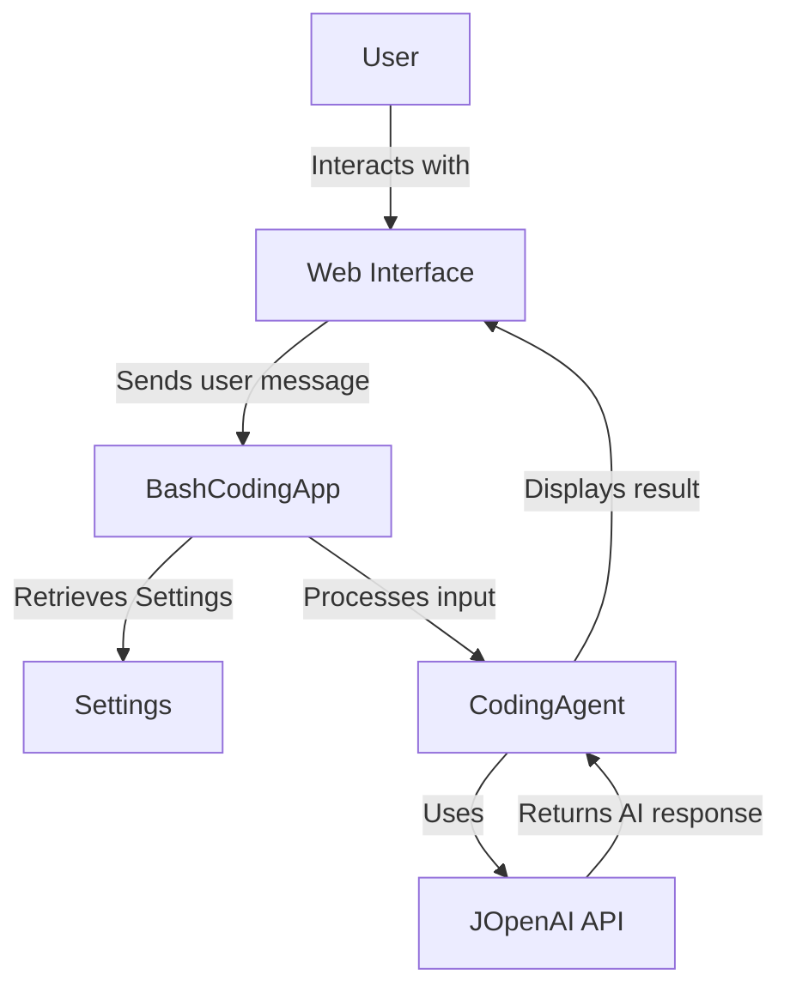


### Code Structure


#### BashCodingApp Class

- **Purpose**: Serves as the main entry point for the application, handling web requests and initializing settings.
- **Key Methods**:
  - `initSettings(session: Session)`: Initializes application settings for a new session.
  - `userMessage(session: Session, user: User?, userMessage: String, ui: ApplicationInterface, api: API)`: Processes user messages and interacts with the AI model.


#### Settings Data Class

- **Purpose**: Stores configuration settings for the application, such as environment variables, working directory, AI model, and command settings.
- **Fields**:
  - `env`: Environment variables for the Bash process.
  - `workingDir`: Working directory for executing commands.
  - `model`: AI model used for generating responses.
  - `temperature`: Controls the randomness of AI responses.
  - `language`: Specifies the programming language (Bash).
  - `command`: The command to execute (default is "bash").


#### CodingAgent Class

- **Purpose**: Handles the interaction with the AI model and processes user inputs.
- **Key Operations**:
  - Starts with user input and settings.
  - Interacts with the JOpenAI API using the specified model and settings.
  - Returns AI-generated responses to the user.


### Integration with JOpenAI API

The application leverages the JOpenAI API for AI functionalities, specifically using the `OpenAIModels.GPT35Turbo` model by default. The `API` class is used to communicate with the API, sending user inputs and receiving AI-generated responses.


### Conclusion

The Bash Coding Assistant v1.0 provides an interactive platform for users to enhance their Bash coding experience with AI-powered suggestions. Its architecture is designed for flexibility and ease of use, making it a valuable tool for developers and enthusiasts alike.

# coding\AwsCodingApp.kt


## AWS Coding Assistant v1.0 Developer Documentation


### Overview

The AWS Coding Assistant v1.0 is a web-based application designed to facilitate coding in AWS environments by providing an interactive interface for users to input their code and receive assistance. It leverages the capabilities of Kotlin interpreters and the OpenAI API to analyze and suggest improvements or alternatives to the user's code. This application is built using the SimiaCryptus framework, integrating various components for web UI, session management, and AWS services interaction.


### Architecture Diagram

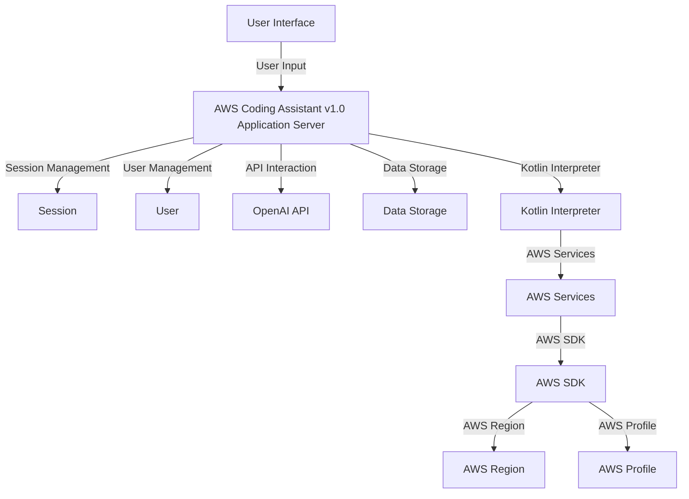


### Components


#### ApplicationServer

The core component that initializes the application, setting up the web server, session management, and routing. It inherits from `ApplicationServer` and is configured with the application name and path.

- **applicationName**: "AWS Coding Assistant v1.0"
- **path**: "/aws"


#### Session and User

These components manage user sessions and user-specific data. The `Session` component tracks active sessions, while the `User` component handles user identification and authentication.


#### API

This component is responsible for interfacing with the OpenAI API, facilitating the interaction between the user's input and the AI models for code analysis and suggestions.


#### KotlinInterpreter

A specialized interpreter for executing Kotlin code. It is utilized to run user-provided code snippets within a controlled environment, ensuring safety and isolation.


#### DataStorage

Manages the persistence of application data, including user settings and session information.


#### AWSServices

Interfaces with AWS services using the AWS SDK. It is configured with region and profile information to access AWS resources.


### Settings

The `Settings` data class encapsulates user-specific settings, including AWS region, profile, temperature (for AI model interaction), and the selected AI model.

- **region**: AWS region ID. Defaults to the region provided by `DefaultAwsRegionProviderChain`.
- **profile**: AWS profile name. Defaults to "default".
- **temperature**: Controls the randomness of AI responses. Defaults to 0.1.
- **model**: Specifies the OpenAI model to use. Defaults to `OpenAIModels.GPT35Turbo`.


### User Interaction Flow

1. The user accesses the AWS Coding Assistant via the web UI.
2. The user inputs a code snippet or query related to AWS coding.
3. The application server processes the input, leveraging the Kotlin Interpreter and OpenAI API to analyze the code and generate suggestions.
4. The application server returns the suggestions to the user through the web UI.


### Conclusion

The AWS Coding Assistant v1.0 provides a powerful tool for developers working with AWS services, offering real-time coding assistance and suggestions. By integrating with OpenAI's models and AWS SDK, it offers a seamless experience for improving and optimizing AWS-related code.

# coding\GmailCodingApp.kt


## Developer Documentation for GmailCodingApp

The `GmailCodingApp` is a sophisticated application designed to integrate Gmail services with a coding assistant, leveraging the capabilities of Kotlin and AI models for code generation and manipulation. This document provides an overview of the application's architecture, setup, and usage.


### Overview

The `GmailCodingApp` extends `ApplicationServer`, providing a specialized service that integrates Gmail functionalities within a coding environment. It utilizes the Gmail API for email interactions and the OpenAI API for coding assistance, offering users a unique platform for managing emails and generating code snippets directly from their inbox.


### Architecture Diagram

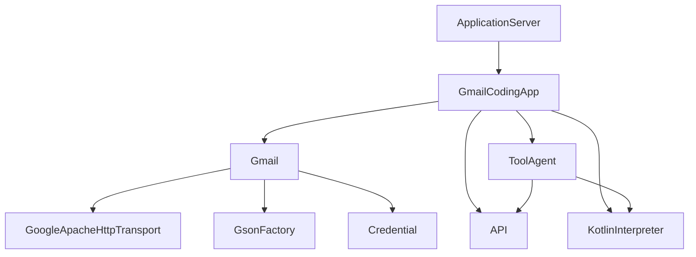


### Components


#### GmailCodingApp

- **Description**: Main class extending `ApplicationServer`. It initializes the application, sets up the Gmail service, and handles user messages.
- **Key Methods**:
  - `userMessage()`: Processes user messages, initializes the Gmail service, and starts the `ToolAgent`.
  - `getSymbols()`: Provides a map of symbols, including the Gmail service, to be used by the `ToolAgent`.
  - `fromString()`: Static method to create an `InterpreterAndTools` instance with initialized Gmail service.


#### ToolAgent

- **Description**: Handles the interaction between the user, the AI model, and the Kotlin interpreter.
- **Key Features**:
  - Utilizes AI models for code generation.
  - Executes Kotlin code through the `KotlinInterpreter`.


#### Gmail

- **Description**: Represents the Gmail service initialized with user credentials.
- **Integration**: Utilizes `GoogleApacheHttpTransport`, `GsonFactory`, and user `Credential` for secure and efficient communication with the Gmail API.


#### KotlinInterpreter

- **Description**: Executes Kotlin code, allowing dynamic code execution within the application.


### Setup and Initialization

1. **Gmail Service Initialization**:
   - Requires user OAuth2 credentials.
   - Utilizes `GoogleApacheHttpTransport` and `GsonFactory` for secure and efficient API communication.

2. **Application Server Setup**:
   - Instantiate `GmailCodingApp` with application name and path.
   - Override `userMessage` to handle incoming user messages and interactions.

3. **ToolAgent Initialization**:
   - Initialized within `userMessage` method.
   - Provided with AI API, Gmail service, and Kotlin interpreter for processing and code execution.


### Usage

- **Starting the Application**: Launch the `GmailCodingApp` server. It listens for user messages and commands.
- **Interacting with the Application**: Users can send messages or commands through the application interface. The application processes these messages, interacts with the Gmail API, and utilizes AI models and the Kotlin interpreter for code generation and execution.


### Conclusion

The `GmailCodingApp` offers a unique integration of Gmail services with AI-powered coding assistance, providing a versatile platform for email management and code generation. Its architecture leverages modern APIs and interpreters, making it a powerful tool for developers and users looking to enhance their productivity and coding capabilities directly from their inbox.

# coding\JDBCCodingApp.kt


## Developer Documentation for JDBCCodingApp

The `JDBCCodingApp` class is a part of the `com.simiacryptus.skyenet.apps.code` package, designed to integrate JDBC (Java Database Connectivity) operations within a coding assistant application. This application leverages the OpenAI API for natural language processing and a Kotlin interpreter for executing code snippets. It is built on top of a web application framework that provides session management, user authentication, and a web UI interface.


### Overview

The `JDBCCodingApp` extends `ApplicationServer`, providing a specialized service that allows users to interact with a database using JDBC through a conversational interface. It dynamically evaluates Kotlin code snippets with database operations, offering a unique tool for developers and learners.


#### Key Components

- **ApplicationServer**: The base class providing web server functionality, session handling, and application lifecycle management.
- **ToolAgent**: A generic agent that handles the execution of code snippets in a specified interpreter, in this case, Kotlin, with additional context provided by symbols related to JDBC operations.
- **JDBCSupplier**: A utility class that wraps a JDBC connection, allowing it to be passed as a symbol for code execution.


#### Workflow

1. **User Interaction**: Users interact with the application through a web UI, sending messages that contain code snippets or queries.
2. **Message Handling**: The `userMessage` method processes incoming messages, establishing a JDBC connection based on user-specific settings.
3. **Code Execution**: A `ToolAgent` instance is created and started, executing the user's code with access to the JDBC connection.
4. **Response Generation**: The application generates responses based on the execution results, which are then displayed to the user.


### Sequence Diagram

Below is a sequence diagram illustrating the process from receiving a user message to executing code with JDBC operations.

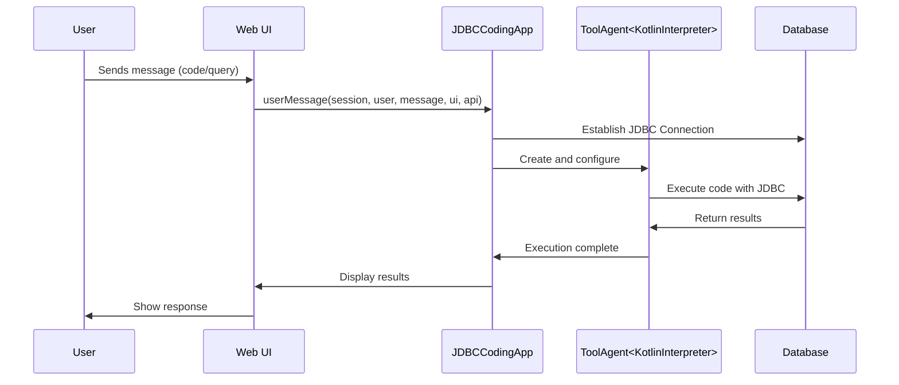


### Class Diagram

The following class diagram provides an overview of the `JDBCCodingApp` and its relationship with other key components.

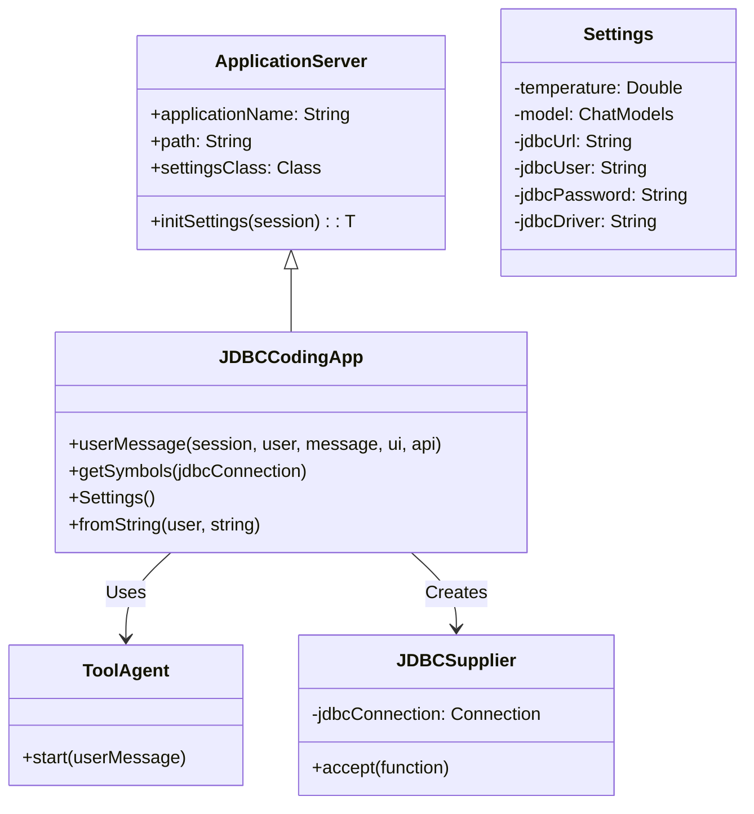


### Conclusion

The `JDBCCodingApp` provides a powerful interface for executing database operations through a conversational UI, leveraging the capabilities of Kotlin and JDBC. This documentation, along with the provided diagrams, should offer a clear understanding of the application's architecture and workflow, aiding developers in maintenance and further development.

# coding\PowershellCodingApp.kt


## Developer Documentation for Powershell Coding Assistant v1.0


### Overview

The Powershell Coding Assistant v1.0 is a web-based application designed to facilitate coding in Powershell by leveraging AI models. It is built on the SimiaCryptus platform and integrates with the JOpenAI API for AI functionalities.


### Architecture

The application architecture is modular, consisting of several key components that interact with each other to provide a seamless user experience. Below is a high-level architecture diagram illustrating the main components and their interactions.

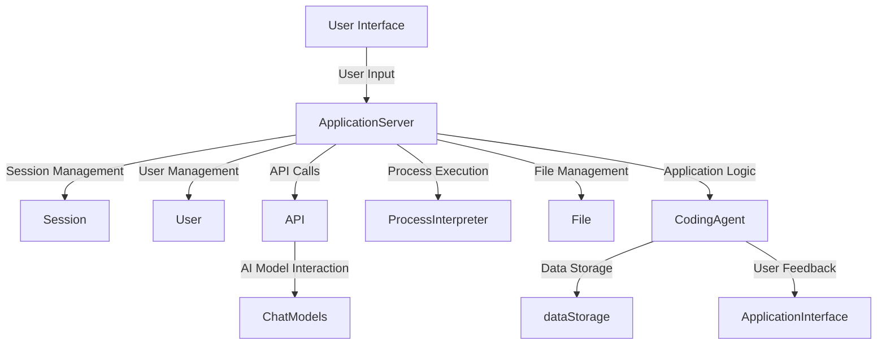


### Components


#### ApplicationServer

The core server component that handles HTTP requests, session management, user interactions, and the initialization of application settings.

- **applicationName**: The name of the application.
- **path**: The URL path where the application is accessible.


#### Settings

A data class that holds the configuration settings for the application. These settings include environment variables, working directory, AI model, temperature for AI responses, language, and the command to execute Powershell scripts.

- **env**: Environment variables for the Powershell process.
- **workingDir**: The working directory for executing commands.
- **model**: The AI model used for generating code suggestions.
- **temperature**: Controls the randomness of AI responses.
- **language**: The programming language, set to "powershell".
- **command**: The command list to initiate Powershell.


#### CodingAgent

Responsible for handling user messages, interacting with the AI model, and executing Powershell commands. It uses the `ProcessInterpreter` for executing system commands and provides feedback to the user through the `ApplicationInterface`.

- **api**: The JOpenAI API client.
- **dataStorage**: Storage for persisting application data.
- **session**: The current user session.
- **user**: The current user.
- **ui**: The application interface for user interaction.
- **interpreter**: The class used for executing system commands.
- **symbols**: A map of symbols used in the coding environment.
- **temperature**: The AI model's temperature setting.
- **model**: The AI model used for generating responses.


#### ProcessInterpreter

A component that executes system commands based on user input and AI suggestions. It is utilized by the `CodingAgent` to run Powershell scripts.


#### ApplicationInterface

The interface through which the application communicates with the user, providing feedback, suggestions, and responses generated by the AI model.


### User Flow

1. The user accesses the application through the web interface.
2. The user inputs a Powershell coding query or command.
3. The `ApplicationServer` processes the input, utilizing the `CodingAgent` to interact with the AI model.
4. The `CodingAgent` executes the Powershell command via the `ProcessInterpreter` and returns the output.
5. The user receives feedback and AI-generated suggestions through the `ApplicationInterface`.


### Conclusion

The Powershell Coding Assistant v1.0 leverages advanced AI models to assist users in coding tasks, providing a powerful tool for developers working with Powershell scripts. Its modular architecture and integration with the JOpenAI API make it a flexible and scalable solution for coding assistance.

# general\IllustratedStorybookApp.kt


## Illustrated Storybook Generator - Developer Documentation

The Illustrated Storybook Generator is a comprehensive application designed to automate the creation of illustrated storybooks. This document provides an overview of the application's architecture, key components, and their interactions.


### Application Overview

The Illustrated Storybook Generator leverages AI models to generate text and images based on user inputs, creating a cohesive storybook. The application is structured into two main classes: `IllustratedStorybookApp` and `IllustratedStorybookAgent`, along with a supporting class `IllustratedStorybookActors` that defines the actors involved in story generation.


#### Key Components

1. **IllustratedStorybookApp**: Serves as the entry point of the application, handling initial user inputs and settings.
2. **IllustratedStorybookAgent**: Manages the generation process, coordinating between different actors to produce the story, illustrations, and narration.
3. **IllustratedStorybookActors**: Defines the actors (requirements gathering, story generation, illustration generation, and narration) and their roles in the storybook creation process.


### Application Flow

The flow of the application from user input to the generation of the illustrated storybook involves several steps, orchestrated by the `IllustratedStorybookAgent`.

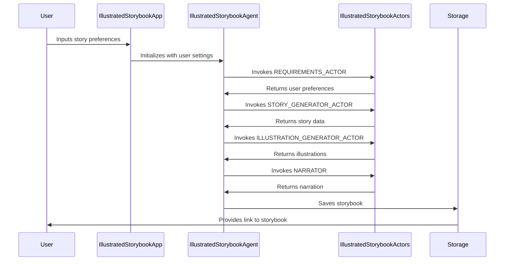


### Detailed Component Interaction


#### 1. User Input Handling

- **User**: Provides story preferences through the `IllustratedStorybookApp`.
- **IllustratedStorybookApp**: Receives user input and initializes the `IllustratedStorybookAgent` with the appropriate settings.


#### 2. Story Generation Process

- **IllustratedStorybookAgent**: Coordinates the story generation process, starting with gathering user preferences using the `REQUIREMENTS_ACTOR`.
- **REQUIREMENTS_ACTOR**: Gathers and returns user preferences for the story.
- **STORY_GENERATOR_ACTOR**: Generates the story text based on user preferences.
- **ILLUSTRATION_GENERATOR_ACTOR**: Creates illustrations for each segment of the story.
- **NARRATOR**: Generates narration for the story.


#### 3. Saving and Presenting the Storybook

- **IllustratedStorybookAgent**: Formats the generated content into an HTML document.
- **Storage**: The HTML document is saved, and a link is provided to the user to access the completed storybook.


### Conclusion

The Illustrated Storybook Generator application demonstrates a sophisticated use of AI models to automate the creation of storybooks. By orchestrating interactions between various components, it offers an end-to-end solution for generating personalized storybooks with text, illustrations, and narration.

# general\OutlineManager.kt


## OutlineManager Documentation

The `OutlineManager` class is designed to manage and manipulate hierarchical text outlines. It provides functionality to clone, validate, expand, and retrieve descriptions from nodes within an outline. This document provides an overview of its structure and functionality.


### Class Structure

The `OutlineManager` class contains several nested data classes (`NodeList`, `Node`, `OutlinedText`) and methods that operate on these structures. Below is a brief overview of each component:


#### OutlinedText

- **Properties**:
  - `text`: The raw text associated with the outline.
  - `outline`: A `NodeList` representing the hierarchical structure of the outline.


#### NodeList

- **Properties**:
  - `children`: A list of `Node` objects representing child nodes in the hierarchy.
- **Methods**:
  - `validate()`: Validates the `NodeList`, ensuring all children are valid and names are unique.
  - `deepClone()`: Creates a deep clone of the `NodeList`.
  - `getTextOutline()`: Generates a text representation of the outline.
  - `getTerminalNodeMap()`: Retrieves a map of terminal (leaf) nodes.


#### Node

- **Properties**:
  - `name`: The name of the node.
  - `children`: A `NodeList` representing child nodes.
  - `description`: A description of the node.
- **Methods**:
  - `validate()`: Validates the `Node`, ensuring it has a name.
  - `deepClone()`: Creates a deep clone of the `Node`.
  - `getTextOutline()`: Generates a text representation of the node and its children.


### Functionality

The `OutlineManager` class provides methods to manipulate and query outlines:

- `expandNodes()`: Expands nodes in a `NodeList`, creating a list of `NodeList` objects with expanded nodes.
- `getLeafDescriptions()`: Retrieves descriptions of all leaf nodes in a `NodeList`.
- `buildFinalOutline()`: Builds the final outline, applying any expansions defined in `expansionMap`.


### Diagrams

Below are Mermaid diagrams illustrating the structure and relationships within the `OutlineManager` class.


#### Class Relationships

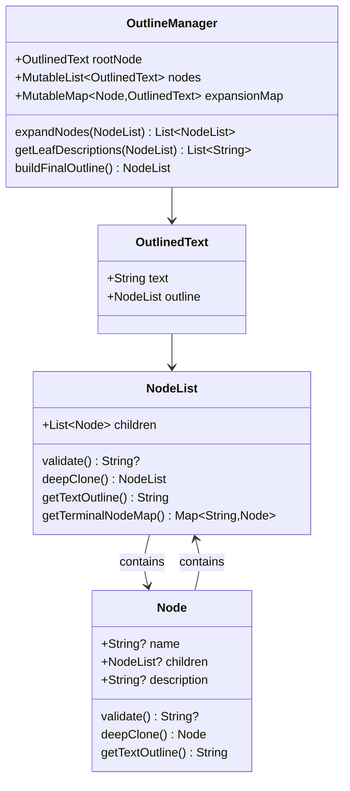


#### Method Flow: expandNodes

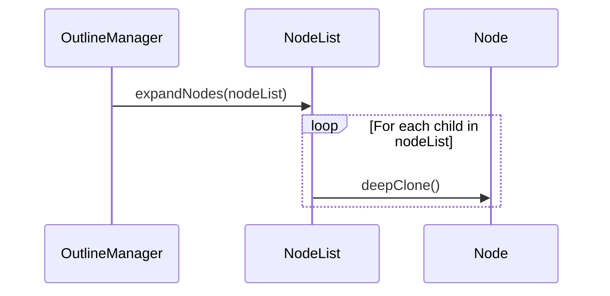

This documentation provides a high-level overview of the `OutlineManager` class and its components. For detailed usage and implementation, refer to the source code and method documentation within the class.

# general\OutlineApp.kt


## Developer Documentation for Outline Expansion Concept Map Application


### Overview

The Outline Expansion Concept Map application, referred to as the Outline Agent, is an AI-powered tool designed to assist users in exploring concepts through the creation and expansion of outlines. It leverages various models from the OpenAI GPT series to generate initial outlines, expand on each section iteratively, and compile the expanded outline into a final, detailed version. Additionally, it visualizes the relationships between different ideas using an Embedding Projector.


### Architecture

The application is structured around a core class, `OutlineApp`, which extends `ApplicationServer`, and a supporting class, `OutlineAgent`, which manages the outline generation and expansion process. The application also defines a set of actors within `OutlineActors` to handle specific tasks in the outline generation process.


#### High-Level Architecture Diagram

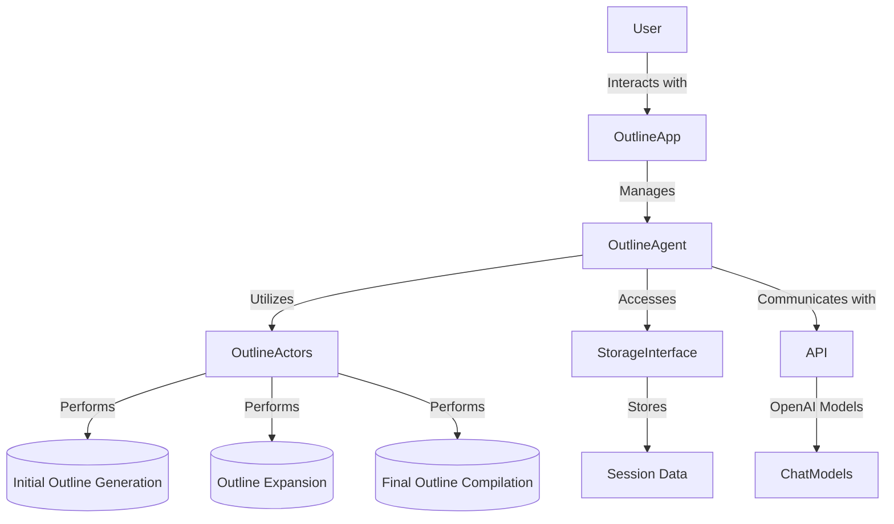


### Key Components


#### OutlineApp

`OutlineApp` serves as the entry point for the application, handling initial setup, user interactions, and the overall application flow. It extends the `ApplicationServer` class, providing web server capabilities and defining endpoints for user interaction.


##### Responsibilities

- Initialize application settings and UI components.
- Handle user messages and delegate the processing to `OutlineAgent`.
- Define application-specific settings and descriptions.


#### OutlineAgent

`OutlineAgent` is responsible for managing the outline generation and expansion process. It interacts with the OpenAI API to generate initial outlines, expand on sections, and compile the final outline. It also manages visualization and final essay generation if enabled.


##### Responsibilities

- Generate the initial outline based on user input.
- Iteratively expand each section of the outline using specified models.
- Compile the expanded sections into a final outline.
- Optionally, visualize embeddings and generate a final essay.


#### OutlineActors

`OutlineActors` defines a set of actors (`INITIAL`, `EXPAND`, `FINAL`) that perform specific tasks in the outline generation process. Each actor type is associated with a specific model and task, such as generating the initial outline, expanding on sections, or compiling the final outline.


##### Responsibilities

- `INITIAL`: Generate an initial outline based on the user's input.
- `EXPAND`: Expand on sections of the outline to add detail.
- `FINAL`: Compile the expanded sections into a final, detailed outline.


### Process Flow

1. **User Interaction**: The user interacts with `OutlineApp` through a web interface, providing an initial topic or idea.
2. **Initial Outline Generation**: `OutlineApp` delegates to `OutlineAgent`, which uses the `INITIAL` actor to generate an initial outline.
3. **Outline Expansion**: `OutlineAgent` iteratively expands each section of the outline using the `EXPAND` actor and the specified models.
4. **Final Outline Compilation**: Once expansion is complete, `OutlineAgent` compiles the expanded sections into a final outline using the `FINAL` actor.
5. **Visualization and Final Essay**: Optionally, `OutlineAgent` visualizes the outline embeddings and generates a final essay.


#### Process Flow Diagram

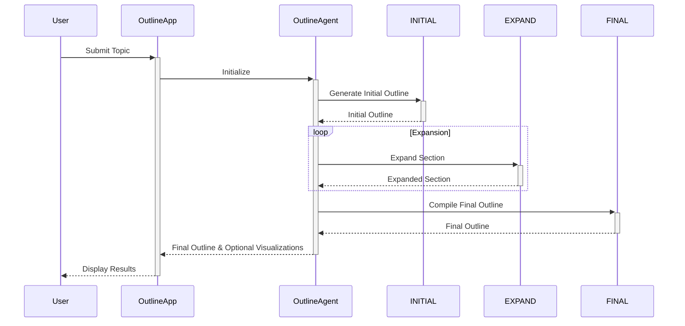


### Conclusion

The Outline Expansion Concept Map application leverages AI to assist users in exploring and expanding on concepts through outline generation. Its architecture is designed to modularly handle different stages of the process, from initial generation to final compilation, with optional visualization and essay generation features.

# general\VocabularyApp.kt


## Developer Documentation for Vocabulary List Generator Application

The Vocabulary List Generator is a sophisticated application designed to assist users in creating comprehensive vocabulary lists complete with definitions and illustrations. This document provides an overview of the application's architecture, including its components and their interactions.


### Application Overview

The application is structured into two primary classes: `VocabularyApp` and `VocabularyAgent`, along with a supporting class `VocabularyActors` that defines the actors involved in generating the vocabulary list.


#### `VocabularyApp` Class

The `VocabularyApp` class extends `ApplicationServer` and serves as the entry point for the application. It handles user messages and initializes the `VocabularyAgent` to generate vocabulary lists based on user input.


##### Key Methods:

- `userMessage`: Processes messages from users, initializes settings, and starts the vocabulary generation process.


#### `VocabularyAgent` Class

The `VocabularyAgent` class extends `ActorSystem` and orchestrates the generation of vocabulary lists. It utilizes different actors for processing user input, generating definitions, and creating illustrations.


##### Key Methods:

- `generate`: Coordinates the workflow for generating vocabulary lists, including parsing user input, generating definitions and illustrations, and compiling the final output.


#### `VocabularyActors` Class

The `VocabularyActors` class defines various actors used by the `VocabularyAgent` for different tasks, such as parsing user input, generating term definitions, and creating illustrations.


##### Actors:

- `UserInterfaceActor`
- `InputProcessorActor`
- `AIDefinitionGeneratorActor`
- `IllustrationGeneratorActor`


### Application Workflow

The following diagram illustrates the workflow of the Vocabulary List Generator application using Mermaid.js syntax:

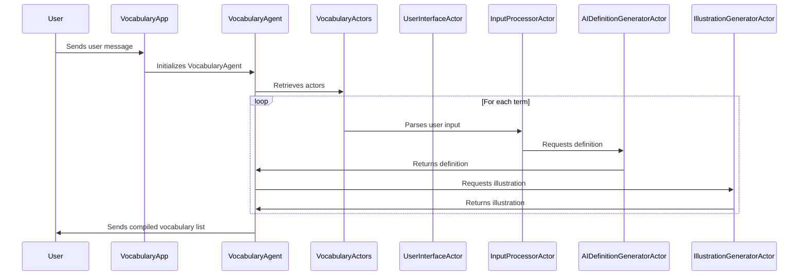


### Data Structures


#### `Settings` Data Class

Holds configuration settings for the application, such as the model and temperature settings for AI operations.


#### `CompiledTerm` Data Class

Represents a compiled term with its definition and illustration.


#### `UserInput` and `TermDefinition` Data Classes

Used by `VocabularyActors` for parsing and processing user input and term definitions.


### Conclusion

The Vocabulary List Generator application leverages a combination of AI models and custom actors to automate the creation of enriched vocabulary lists. This documentation provides a high-level overview of the application's architecture and workflow, aiding developers in understanding and contributing to the project.

# generated\LibraryGeneratorApp.kt


## Developer Documentation for LibraryGeneratorApp


### Overview

The `LibraryGeneratorApp` is a comprehensive system designed to automate the process of generating software libraries. It leverages OpenAI's GPT models to interpret user requirements, design data structures, outline functions, synthesize code, compose documentation, create test cases, assess quality, and format the output for presentation. This system is built on a modular architecture, allowing for easy extension and customization.


### System Architecture

The system is structured around a core application server (`LibraryGeneratorApp`) that interfaces with users and manages sessions. It delegates tasks to a specialized agent (`LibraryGeneratorAgent`), which orchestrates a series of actors (`LibraryGeneratorActors`) to perform specific tasks in the library generation process.


#### High-Level Architecture Diagram

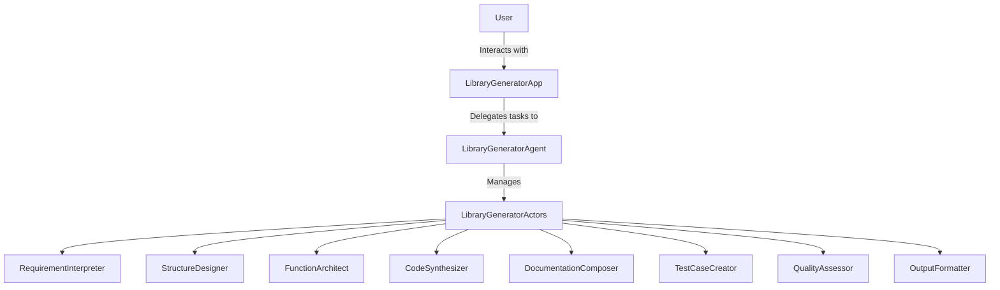


### Key Components


#### LibraryGeneratorApp

The main entry point for the application, responsible for initializing the server, handling user messages, and managing sessions.

- **Settings**: Manages application settings such as model selection, temperature, and budget.
- **userMessage**: Processes messages from users, initiating the library generation process.


#### LibraryGeneratorAgent

Orchestrates the library generation process, interacting with various actors to perform specific tasks.

- **pseudocodeBreakdown**: Main method that orchestrates the breakdown of user prompts into pseudocode and further into detailed library components.
- **outlineFunction**, **synthesizeCodeForFunction**, **formatOutput**, etc.: Helper methods that delegate tasks to specific actors.


#### LibraryGeneratorActors

Defines a collection of actors, each responsible for a specific aspect of the library generation process.

- **RequirementInterpreter**: Extracts requirements from user prompts.
- **StructureDesigner**: Designs data structures based on requirements.
- **FunctionArchitect**: Outlines functions.
- **CodeSynthesizer**: Generates code snippets.
- **DocumentationComposer**: Creates documentation for code snippets.
- **TestCaseCreator**: Generates test cases for code snippets.
- **QualityAssessor**: Assesses the quality of generated artifacts.
- **OutputFormatter**: Formats the output for presentation.


#### Actors Interaction Diagram

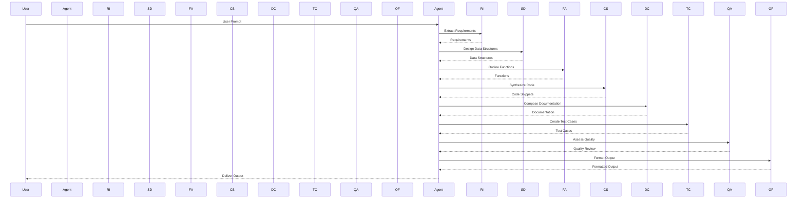


### Usage

To use the `LibraryGeneratorApp`, instantiate it with the desired application name and domain name, then start the server. Users can interact with the application through a web interface or API, providing prompts that describe the software library they wish to generate. The system will process these prompts and return a comprehensive software library package, including code, documentation, and test cases.


### Extending the System

To extend the system, developers can add new actors to the `LibraryGeneratorActors` class or modify existing actors to support additional functionality. Custom actors should implement the `BaseActor` interface and be registered in the `actorMap` for proper orchestration by the `LibraryGeneratorAgent`.


### Conclusion

The `LibraryGeneratorApp` provides a powerful framework for automating the generation of software libraries. Its modular architecture and use of advanced AI models make it a versatile tool for developers looking to streamline their workflow.

# generated\SoftwareProjectGenerator.kt


## Software Project Generator Application Documentation


### Overview

The Software Project Generator Application is designed to automate the process of generating software project scaffolding based on user input. It leverages OpenAI's GPT models to interpret user requirements and generate the necessary code, project structure, and documentation. This application is built using the SimiaCryptus framework, which provides a robust platform for developing AI-powered applications.


### Architecture

The application's architecture is divided into three main components: `SoftwareProjectGeneratorApp`, `SoftwareProjectGeneratorAgent`, and `SoftwareProjectGeneratorActors`. Below is a high-level overview of these components and their interactions.

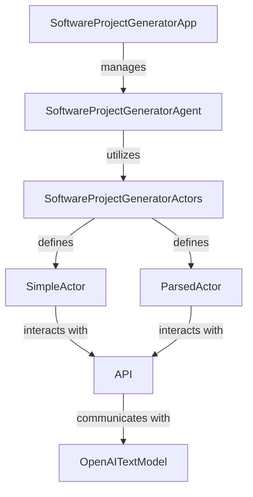


#### SoftwareProjectGeneratorApp

This is the entry point of the application. It extends `ApplicationServer` and is responsible for initializing the application, handling user messages, and managing sessions. It uses `SoftwareProjectGeneratorAgent` to process user messages and generate software projects.


##### Key Methods

- `userMessage`: Handles messages from users and initiates the software project generation process.


#### SoftwareProjectGeneratorAgent

This component orchestrates the project generation process. It extends `ActorSystem` and utilizes different actors defined in `SoftwareProjectGeneratorActors` to perform specific tasks like project structure analysis, code generation, and feature development.


##### Key Methods

- `softwareProjectGenerator`: Orchestrates the entire process of generating a software project based on user input.
- `projectStructureAnalysis`: Analyzes the project structure based on user descriptions.
- `codeGeneration`: Generates scaffolding code for the project.
- `featureDevelopment`: Develops features specified in the project structure.
- `interactiveRefinement`: Allows users to refine the project interactively (optional).
- `finalization`: Finalizes the project by generating build scripts and documentation.


#### SoftwareProjectGeneratorActors

Defines the actors used by `SoftwareProjectGeneratorAgent` to perform specific tasks. It includes `SimpleActor` for generating code and `ParsedActor` for analyzing and parsing text.


##### Actors

- `SimpleActor`: Generates code and project scaffolding based on prompts.
- `ParsedActor`: Analyzes and parses user input to understand project requirements.


### Workflow

The workflow of generating a software project involves several steps, starting from analyzing the project requirements to finalizing the project with documentation and build scripts.

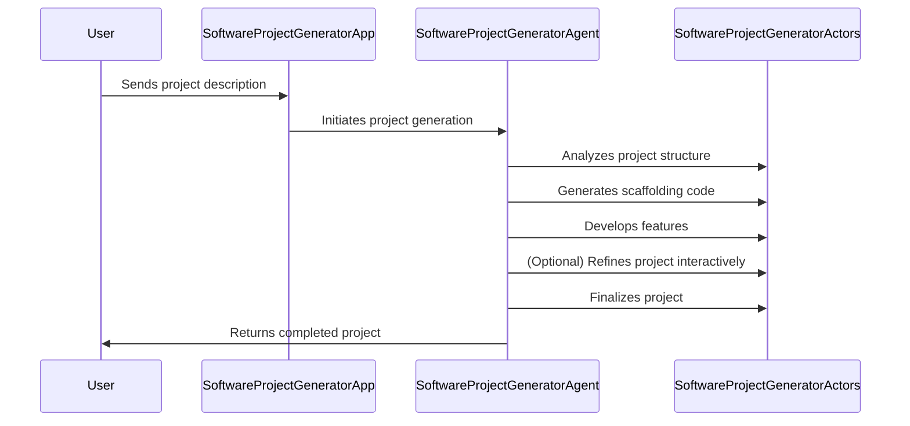


### Conclusion

The Software Project Generator Application simplifies the process of creating software projects by automating the generation of scaffolding, code, and documentation. By leveraging AI models, it provides a flexible and efficient way to translate user requirements into ready-to-use software projects.

# generated\TestGeneratorApp.kt


## Test Generator Application Documentation

The Test Generator Application is designed to automate the process of generating test questions and answers based on a given prompt. This document provides an overview of the application's architecture, key components, and their interactions.


### Overview

The application leverages OpenAI's GPT models to identify topics within a text, generate relevant questions, and produce corresponding answers. It is structured into two main components: `TestGeneratorApp` and `TestGeneratorAgent`, supported by a set of actors defined in `TestGeneratorActors`.


#### Components

1. **TestGeneratorApp**: Serves as the entry point for user interactions, handling user messages and initializing settings.
2. **TestGeneratorAgent**: Manages the generation process, coordinating between different actors to produce the final output.
3. **TestGeneratorActors**: Defines a set of actors responsible for specific tasks in the generation process, such as topic identification and question generation.


### Architecture Diagram

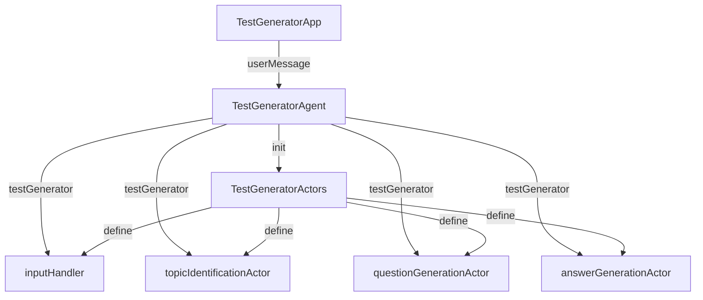


### Key Processes


#### 1. User Message Handling

When a user sends a message to the `TestGeneratorApp`, it triggers the `userMessage` method. This method retrieves the user's settings and initiates the `TestGeneratorAgent` to process the message.


#### 2. Test Generation Process

The `TestGeneratorAgent` orchestrates the test generation process through the following steps:

1. **Topic Identification**: The `topicIdentificationActor` identifies key topics and keywords from the user's prompt.
2. **Question Generation**: For each identified topic, the `questionGenerationActor` generates a set of questions.
3. **Answer Generation**: For each question, the `answerGenerationActor` produces corresponding answers.

Each step involves interaction with the respective actor defined in `TestGeneratorActors`, utilizing GPT models for content generation.


### Actors and Their Roles


#### Input Handler

- **Purpose**: Processes the initial user prompt to guide subsequent steps.
- **Actor**: `inputHandler`


#### Topic Identification Actor

- **Purpose**: Identifies key topics and keywords within the text.
- **Actor**: `topicIdentificationActor`


#### Question Generation Actor

- **Purpose**: Generates a set of questions based on identified topics.
- **Actor**: `questionGenerationActor`


#### Answer Generation Actor

- **Purpose**: Produces answers for the generated questions.
- **Actor**: `answerGenerationActor`


### Conclusion

The Test Generator Application demonstrates a sophisticated use of AI models to automate the creation of educational content. By decomposing the process into distinct steps handled by specialized actors, the application efficiently generates relevant and diverse test materials based on user-provided prompts.

# generated\AutomatedLessonPlannerApp.kt


## Developer Documentation for Automated Lesson Planner Architecture

The Automated Lesson Planner Architecture is designed to facilitate the creation of dynamic and customizable lesson plans using AI-driven insights. This system leverages a series of actors, each responsible for a specific aspect of lesson planning, from curriculum mapping to feedback analysis.


### System Overview

The architecture is built around the concept of actors, each performing a distinct role in the lesson planning process. These actors interact with an AI backend, processing user inputs (e.g., learning objectives, available resources) and generating structured outputs (e.g., curriculum mappings, lesson timelines).


#### Actors and Their Roles

1. **Curriculum Mapper Actor**: Maps learning objectives to curriculum standards.
2. **Resource Allocator Actor**: Suggests activities based on available resources.
3. **Time Manager Actor**: Creates a lesson timeline based on activities and time constraints.
4. **Assessment Planner Actor**: Suggests assessment methods based on learning objectives.
5. **Customization Actor**: Allows teachers to customize the generated lesson plan.
6. **Feedback Analyzer Actor**: Analyzes teacher feedback for continuous improvement.


### System Architecture Diagram

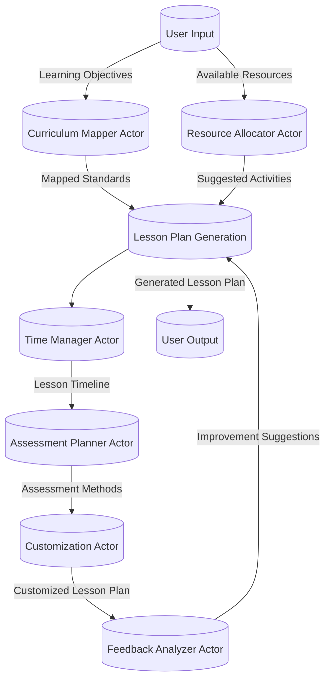


### Key Components


#### AutomatedLessonPlannerArchitectureApp

This class serves as the entry point for the application, handling initialization and user interactions. It configures the application server and sets up the necessary settings for the AI model and budget.


##### Key Methods:

- `userMessage()`: Processes user messages and initiates the lesson planning process.


#### AutomatedLessonPlannerArchitectureAgent

This class orchestrates the lesson planning process, coordinating between different actors to generate a comprehensive lesson plan based on user inputs.


##### Key Methods:

- `automatedLessonPlannerArchitecture()`: Main method that orchestrates the lesson planning process.
- `customizeLessonPlan()`: Allows customization of the generated lesson plan.
- `analyzeFeedback()`: Analyzes feedback for continuous improvement.


#### Actors (AutomatedLessonPlannerArchitectureActors)

Defines the actors involved in the lesson planning process, each encapsulated in its own class with specific responsibilities.


##### Key Actors:

- `CurriculumMapperActor`
- `ResourceAllocatorActor`
- `TimeManagerActor`
- `AssessmentPlannerActor`
- `CustomizationActor`
- `FeedbackAnalyzerActor`

Each actor interacts with the AI model to process inputs and generate outputs relevant to its domain.


### Data Flow

1. **User Input**: The process begins with the user input, which includes learning objectives, available resources, and any specific requirements for the lesson plan.
2. **Actor Processing**: Each actor processes the input relevant to its domain and interacts with the AI model to generate structured outputs.
3. **Lesson Plan Generation**: The outputs from various actors are combined to generate a draft lesson plan.
4. **Customization and Feedback**: The draft lesson plan is presented to the user for customization. Post-customization, the user can provide feedback, which is analyzed for continuous improvement.
5. **User Output**: The final lesson plan is presented to the user.


### Conclusion

The Automated Lesson Planner Architecture leverages AI to streamline the lesson planning process, making it more efficient and customizable. By dividing the process into distinct roles handled by specialized actors, it ensures a comprehensive approach to lesson planning that can adapt to various educational needs.

# generated\VocabularyListBuilderApp.kt


## Vocabulary List Builder Application Documentation


### Overview

The Vocabulary List Builder Application is designed to assist users in generating vocabulary lists complete with definitions, illustrations, and feedback mechanisms. It leverages the OpenAI API to create engaging and educational content tailored to specific audiences and styles.


### Architecture

The application is structured around a core server (`VocabularyListBuilderApp`) that interfaces with an actor system (`VocabularyListBuilderAgent`) to process user inputs and generate vocabulary lists. The actor system utilizes specialized actors for parsing inputs, generating definitions, creating illustration descriptions, and refining content based on feedback.


#### High-Level Architecture Diagram

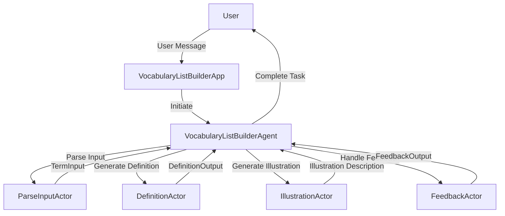


### Components


#### VocabularyListBuilderApp

This is the main server component that handles user messages and initiates the vocabulary list building process.

- **Settings**: Configures the OpenAI model and temperature settings.
- **userMessage**: Processes user messages and initiates the vocabulary list building process using `VocabularyListBuilderAgent`.


#### VocabularyListBuilderAgent

Acts as the orchestrator for generating vocabulary lists. It utilizes different actors to parse inputs, generate definitions and illustrations, and handle feedback.

- **TermInput**: Data class for parsing user input.
- **vocabularyListBuilder**: Overloaded methods for initiating the vocabulary list building process.
- **generate_definition**: Generates a definition for a given term.
- **generate_illustration**: Generates an illustration description for a given term.
- **handle_feedback**: Refines definitions and illustrations based on user feedback.
- **customize**: Customizes content based on specific requirements.


#### Actors


##### VocabularyListBuilderActors

Defines the actors used by `VocabularyListBuilderAgent` for various tasks.

- **DefinitionActor**: Generates definitions for terms.
- **IllustrationActor**: Creates illustration descriptions.
- **FeedbackActor**: Refines content based on feedback.
- **ParseInputActor**: Parses user input into structured data.


#### Data Classes

- **Settings**: Holds configuration settings for the application.
- **TermInput**: Represents user input for a term to be processed.
- **DefinitionOutput**: Output from the definition actor.
- **FeedbackOutput**: Output from the feedback actor.


### Sequence Diagram for Vocabulary List Building

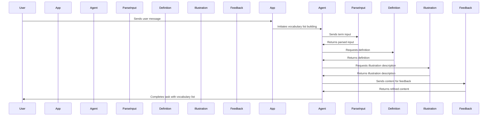

This documentation provides a comprehensive overview of the Vocabulary List Builder Application, detailing its architecture, components, and the flow of data through the system.

# GmailService.kt


## GmailService Developer Documentation

The `GmailService` class is designed to facilitate the interaction with the Gmail API, allowing for operations such as reading Gmail labels and messages. This documentation provides an overview of its structure, setup, and usage.


### Overview

The `GmailService` class encapsulates the necessary steps to authenticate and communicate with the Gmail API. It handles OAuth2 authentication, session management, and the creation of service instances for API requests.


#### Key Components

- **GoogleAuthorizationCodeFlow**: Manages the OAuth 2.0 authorization code flow.
- **LocalServerReceiver**: Handles the local server for receiving the OAuth2 callback.
- **Gmail.Builder**: Constructs a new Gmail service client.


#### Workflow Diagram

```mermaid
sequenceDiagram
    participant User
    participant GmailService
    participant GoogleAuthorizationCodeFlow
    participant LocalServerReceiver
    participant GmailAPI

    User->>GmailService: Request Service
    GmailService->>GoogleAuthorizationCodeFlow: Initiate Auth Flow
    GoogleAuthorizationCodeFlow->>LocalServerReceiver: Start Local Server
    LocalServerReceiver->>User: Await Authorization
    User->>LocalServerReceiver: Authorize
    LocalServerReceiver->>GoogleAuthorizationCodeFlow: Receive Auth Code
    GoogleAuthorizationCodeFlow->>GmailService: Exchange Code for Tokens
    GmailService->>GmailAPI: Create Gmail Service Instance
    GmailAPI->>User: Provide Gmail Operations
```


### Setup


#### Prerequisites

- Google Cloud Project with Gmail API enabled.
- OAuth 2.0 Client IDs configured in the Google Cloud Console.
- `google-credentials.json.kms` file containing the OAuth 2.0 Client IDs.


#### Initialization

Instantiate the `GmailService` class with the necessary parameters:

- `applicationName`: Name of your application.
- `jsonFactory`: Instance of `JsonFactory` for parsing JSON.
- `tokensDir`: Directory to store authorization tokens.
- `credentialsResourcePath`: Path to the encrypted credentials file.
- `scopes`: Gmail API scopes required for your application.

Example:

```java
GmailService gmailService = new GmailService(
    "My Application",
    GsonFactory.getDefaultInstance(),
    "tokens",
    "/path/to/google-credentials.json.kms",
    Arrays.asList(GmailScopes.GMAIL_LABELS, GmailScopes.GMAIL_READONLY)
);
```


### Usage


#### Authenticating

Call `getCredentials()` to authenticate the user and obtain an instance of `Credential`. This method handles the OAuth2 flow, storing and retrieving tokens as necessary.


#### Accessing Gmail Services

Once authenticated, use `getGmailService()` to obtain an instance of `Gmail`, which can be used to perform API operations such as reading messages or labels.

Example:

```java
Gmail gmail = gmailService.getGmailService();
// Use the Gmail instance for API requests, e.g., list labels
ListLabelsResponse labelsResponse = gmail.users().labels().list("me").execute();
for (Label label : labelsResponse.getLabels()) {
    System.out.println(label.getName());
}
```


### Conclusion

The `GmailService` class simplifies the process of integrating Gmail API operations into Java applications. By handling the complexities of OAuth2 authentication and session management, it allows developers to focus on implementing the core functionality of their applications.

# premium\ExampleActors.kt


## Developer Documentation for ExampleActors Interface

The `ExampleActors` interface in the `com.simiacryptus.skyenet.apps.premium` package provides a structured way to interact with various types of actors, including parsers, coders, and image generators, using the OpenAI API. This documentation outlines the structure, usage, and interaction flow between the components of the `ExampleActors` interface.


### Overview

The `ExampleActors` interface is designed to facilitate the creation and utilization of different actor types for specific tasks such as parsing text, generating code, simple text responses, and creating images based on descriptions. It leverages models from the OpenAI API, specifically the GPT models, to perform these tasks.


### Components

The main components of the `ExampleActors` interface include:

- **ExampleParser**: A functional interface for parsing text into a structured format.
- **ExampleResult**: A data class representing the result of parsing.
- **ParsedActor**: An actor for parsing text using a specified model.
- **CodingActor**: An actor for generating and executing code based on prompts.
- **SimpleActor**: An actor for generating simple text responses.
- **ImageActor**: An actor for generating images based on text descriptions.


### Interaction Flow

The following diagram illustrates the interaction flow between the components of the `ExampleActors` interface:

```mermaid
sequenceDiagram
    participant User
    participant ExampleActors
    participant ParsedActor
    participant CodingActor
    participant SimpleActor
    participant ImageActor
    participant OpenAIAPI

    User->>ExampleActors: Request (parse, code, text, image)
    alt Parsing Request
        ExampleActors->>ParsedActor: Parse text
        ParsedActor->>OpenAIAPI: Use GPT model
        OpenAIAPI->>ParsedActor: Parsed result
        ParsedActor->>ExampleActors: Return parsed object
    else Coding Request
        ExampleActors->>CodingActor: Generate code
        CodingActor->>OpenAIAPI: Use GPT model
        OpenAIAPI->>CodingActor: Code & execution result
        CodingActor->>ExampleActors: Return code result
    else Text Response Request
        ExampleActors->>SimpleActor: Generate text
        SimpleActor->>OpenAIAPI: Use GPT model
        OpenAIAPI->>SimpleActor: Text response
        SimpleActor->>ExampleActors: Return text
    else Image Request
        ExampleActors->>ImageActor: Generate image
        ImageActor->>OpenAIAPI: Use GPT model
        OpenAIAPI->>ImageActor: Image
        ImageActor->>ExampleActors: Return image
    end
    ExampleActors->>User: Response (parsed object, code, text, image)
```


### Usage Examples


#### Parsing Text

```kotlin
val parsedActor = ExampleActors.exampleParsedActor()
val parsedResult = ExampleActors.useExampleParsedActor(parsedActor)
```


#### Generating Code

```kotlin
val codeResult = ExampleActors.useExampleCodingActor()
```


#### Generating Text Response

```kotlin
val textResponse = ExampleActors.useExampleSimpleActor()
```


#### Generating Image

```kotlin
val image = ExampleActors.useExampleImageActor()
```


### Conclusion

The `ExampleActors` interface provides a powerful and flexible way to leverage the capabilities of the OpenAI API for various tasks, including parsing, coding, text generation, and image creation. By understanding the components and interaction flow, developers can effectively utilize this interface in their applications.

# premium\MetaAgentApp.kt


## MetaAgentApp Developer Documentation


### Overview

The `MetaAgentApp` is a sophisticated framework designed to streamline the process of creating custom AI agents. It leverages OpenAI's language models to assist users in designing and implementing AI agents tailored to specific needs and preferences. The application is structured around a core system that interacts with various types of actors to perform tasks ranging from high-level design to code generation.


### System Architecture

The architecture of the MetaAgentApp is modular, consisting of several key components that interact with each other to facilitate the creation of AI agents. Below is a high-level overview of the system architecture, illustrated using a mermaid.js diagram.

```mermaid
graph TD;
    MetaAgentApp-->ApplicationServer;
    ApplicationServer-->Session;
    ApplicationServer-->User;
    ApplicationServer-->API;
    ApplicationServer-->ApplicationInterface;
    MetaAgentApp-->MetaAgentAgent;
    MetaAgentAgent-->ActorSystem;
    ActorSystem-->MetaAgentActors;
    MetaAgentActors-->SimpleActor;
    MetaAgentActors-->ParsedActor;
    MetaAgentActors-->CodingActor;
    MetaAgentActors-->ImageActor;
    MetaAgentActors-->ActorType;
    MetaAgentAgent-->Settings;
    MetaAgentAgent-->DesignParser;
    MetaAgentAgent-->FlowParser;
    MetaAgentAgent-->ActorParser;
```


#### Key Components

- **MetaAgentApp**: The main application class that extends `ApplicationServer`. It initializes the application, sets up the server, and handles user messages.
- **ApplicationServer**: A base class that provides functionalities for web server operations, session management, and user interactions.
- **Session & User**: Classes representing the session and user information, respectively.
- **API**: Represents the interface to interact with OpenAI's API for generating responses based on user input.
- **ApplicationInterface**: An interface for managing user interactions and displaying information on the web UI.
- **MetaAgentAgent**: The core class responsible for orchestrating the agent creation process. It utilizes various actors to perform specific tasks.
- **ActorSystem**: Manages the lifecycle and interactions of different actors within the system.
- **MetaAgentActors**: Defines the types of actors and their roles in the system. Actors include `SimpleActor`, `ParsedActor`, `CodingActor`, and `ImageActor`.
- **ActorType**: An enumeration of different actor types available in the system.
- **Settings**: A data class holding configuration settings for the application.
- **DesignParser, FlowParser, ActorParser**: Interfaces for parsing design, flow, and actor information from user inputs.


### Workflow

The workflow of the MetaAgentApp involves several steps, from receiving user input to generating the final code for the custom AI agent. The process is iterative, allowing users to provide feedback and make adjustments at various stages.

1. **User Input**: The user provides a prompt describing the purpose of the agent.
2. **High-Level Design**: The system guides the user through a high-level design process, utilizing `SimpleActor` and `ParsedActor` to generate and refine the design.
3. **Actor Design**: Based on the high-level design, the system uses `ActorParser` to detail the requirements for each actor.
4. **Implementation**: The `CodingActor` and other actors generate the code for the agent. The user can download and tailor this code as needed.


### Conclusion

The MetaAgentApp provides a powerful and flexible framework for creating custom AI agents. Its modular architecture and iterative design process enable users to easily design and implement agents that meet their specific requirements.

# premium\DebateApp.kt


## Developer Documentation for Automated Debate Concept Map Application

The Automated Debate Concept Map Application is designed to facilitate and visualize debates on various topics using AI-powered agents. This document provides an overview of the application's architecture, key components, and their interactions.


### Application Overview

The application leverages the OpenAI API to generate debates on user-submitted topics. It structures the debate by generating questions and responses from different perspectives, then visualizes the relationships between these ideas using an embedding projector.


#### Key Components

1. **DebateApp**: The main server component that handles user interactions and initializes the debate process.
2. **DebateAgent**: Manages the debate flow, including generating moderator and debater responses.
3. **DebateActors**: Defines different actor roles (e.g., Moderator, Debater) and their behaviors in the debate.
4. **StorageInterface**: Manages data persistence, storing debate outlines and arguments.
5. **ApplicationInterface**: Facilitates communication between the backend and the frontend, displaying the debate and visualizations to the user.


#### Component Interactions

```mermaid
sequenceDiagram
    participant User
    participant DebateApp
    participant DebateAgent
    participant DebateActors
    participant StorageInterface
    participant ApplicationInterface

    User->>DebateApp: Submits topic
    DebateApp->>DebateAgent: Initializes debate
    DebateAgent->>DebateActors: Requests moderator and debaters
    DebateActors->>DebateAgent: Returns configured actors
    loop Debate Generation
        DebateAgent->>DebateActors: Generates questions and responses
        DebateActors->>StorageInterface: Stores debate outlines
    end
    DebateAgent->>ApplicationInterface: Sends debate for visualization
    ApplicationInterface->>User: Displays debate and visual insights
```


### Detailed Component Descriptions


#### DebateApp

The `DebateApp` class extends `ApplicationServer`, providing the web server functionality. It initializes the debate settings and handles user messages to start the debate process.

- **Settings**: Configures the AI model, response temperature, and budget for the debate.
- **userMessage**: Processes user-submitted topics and initiates the debate through `DebateAgent`.


#### DebateAgent

Responsible for orchestrating the debate, `DebateAgent` interacts with `DebateActors` to generate moderator introductions, questions, and debater responses.

- **debate**: Main method that drives the debate process, including generating visualizations of the debate landscape.


#### DebateActors

Defines the roles within a debate (e.g., Moderator, Debater) and their behavior. Each actor type has specific prompts and configurations for generating responses.

- **ActorType**: Enum defining different actor roles.
- **getActorConfig**: Configures debater actors with specific prompts and AI model settings.


#### StorageInterface and ApplicationInterface

- **StorageInterface**: Abstracts the data storage mechanism, allowing debate outlines and arguments to be persisted.
- **ApplicationInterface**: Manages the interaction between the backend and the frontend, ensuring that the debate and its visual insights are properly displayed to the user.


### Conclusion

The Automated Debate Concept Map Application leverages AI to generate and visualize debates on various topics. Through its modular design, it efficiently orchestrates the debate process, from topic submission to the presentation of visual insights.

# premium\PresentationDesignerApp.kt


## Presentation Designer Application Documentation

The Presentation Designer Application is a sophisticated system designed to automate the creation of presentations based on user input. It leverages OpenAI's GPT models and other AI technologies to generate slides, images, and speaking notes. This document outlines the architecture, components, and workflow of the application.


### System Overview

The Presentation Designer Application is built on a modular architecture that integrates various AI models and custom actors to process user requests into complete presentations. The core components include:

- **PresentationDesignerApp**: The main application server that handles user interactions and orchestrates the presentation generation process.
- **PresentationDesignerAgent**: Manages the generation of presentation content, including slide outlines, detailed content, images, and speaking notes.
- **PresentationDesignerActors**: Defines a collection of actors responsible for specific tasks in the presentation generation process, such as content expansion, slide formatting, and image rendering.


### Workflow Diagram

The following diagram illustrates the high-level workflow of the Presentation Designer Application using mermaid.js syntax:

```mermaid
sequenceDiagram
    participant User
    participant PresentationDesignerApp as App
    participant PresentationDesignerAgent as Agent
    participant PresentationDesignerActors as Actors
    participant API

    User->>App: Submit presentation request
    App->>Agent: Initialize presentation generation
    Agent->>Actors: Request initial slide outlines
    Actors->>API: Query GPT model
    API-->>Actors: Return slide outlines
    Actors->>Agent: Provide slide outlines
    loop For each slide
        Agent->>Actors: Request detailed content
        Actors->>API: Query GPT model
        API-->>Actors: Return detailed content
        Actors->>Agent: Provide detailed content
        Agent->>Actors: Request slide formatting
        Actors->>API: Query GPT model
        API-->>Actors: Return formatted slide
        Actors->>Agent: Provide formatted slide
    end
    Agent->>App: Return generated presentation
    App->>User: Display presentation
```


### Component Descriptions


#### PresentationDesignerApp

The `PresentationDesignerApp` class extends `ApplicationServer` and serves as the entry point for users to interact with the application. It defines the application's name, path, and description. It also initializes user settings and handles incoming messages from users, delegating the presentation generation tasks to the `PresentationDesignerAgent`.


#### PresentationDesignerAgent

The `PresentationDesignerAgent` class orchestrates the presentation generation process. It utilizes various actors defined in `PresentationDesignerActors` to perform tasks such as generating slide outlines, expanding content, formatting slides, and rendering images. It manages the workflow of taking a user's request and transforming it into a complete presentation.


#### PresentationDesignerActors

The `PresentationDesignerActors` class defines a collection of actors, each responsible for a specific part of the presentation generation process. These actors include:

- **InitialAuthor**: Generates initial slide outlines based on user input.
- **ContentExpander**: Expands slide outlines into detailed content.
- **SlideFormatter**: Formats slides with HTML and CSS for visual appeal.
- **ImageRenderer**: Creates images to accompany slide content.
- **SpeakerNotes**: Generates speaking notes for each slide.

Each actor interacts with OpenAI's GPT models or other AI technologies to perform its designated task.


### Conclusion

The Presentation Designer Application demonstrates the power of integrating AI technologies to automate complex tasks such as presentation generation. By leveraging OpenAI's GPT models and a modular architecture, the application provides a seamless experience for users to generate presentations based on their input.

